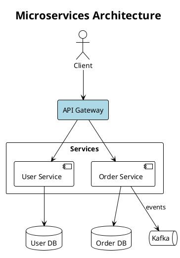
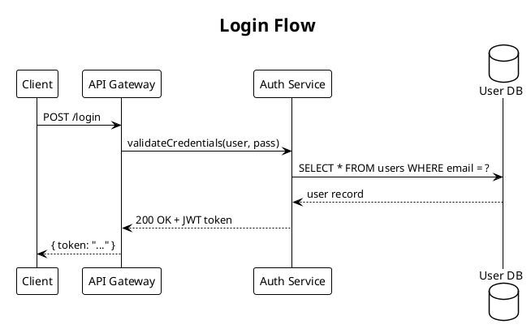
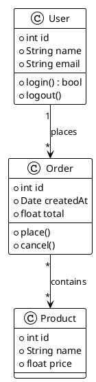
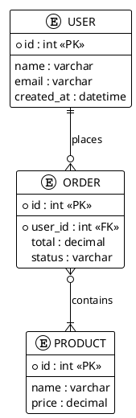
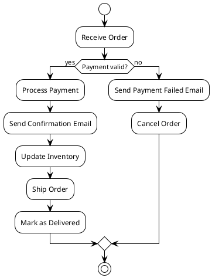
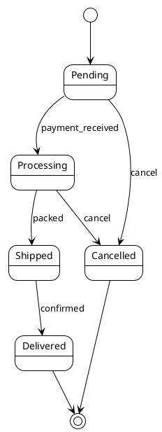
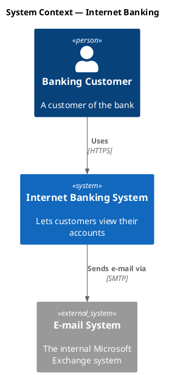

# PlantUML Diagram Skill

## Overview

Generate `.puml` PlantUML diagram files and export to PNG/SVG using **Kroki** — a cloud rendering API that requires no local installation beyond `curl`.

**Format:** `.puml` (PlantUML text)
**Renderer:** Kroki API (`https://kroki.io`) — just `curl`, no Java needed
**Output:** PNG, SVG
**Diagram types:** sequence, component, class, ER, activity, use case, state, C4, and more

## When to Use

**Explicit triggers:**
- "plantuml diagram", "sequence diagram", "class diagram", "component diagram"
- "UML", "activity diagram", "use case diagram", "state machine"
- "visualize", "draw", "diagram", "flowchart", "architecture chart"

**Proactive triggers:**
- Explaining a system with 3+ interacting components
- Describing API flows, authentication sequences, message passing
- Showing class hierarchies, database schemas, or ER models
- Illustrating state machines or lifecycle flows

**When NOT to use it — route elsewhere:**
- General, non-UML quick diagrams embedded in Markdown → **mermaid**.
- Freeform, heavily-styled, or branded diagrams needing pixel control → **drawio**.
- A hand-drawn / sketchy look → **excalidraw** or **tldraw**.

## Modes

Once triggered, route by what the user actually wants — then run the shared render loop (Steps 4–8):

| Mode | The user wants… | Entry point |
|---|---|---|
| **Generate** (default) | a diagram from a text description | Steps 1–8 below |
| **From code** | a diagram of existing source code | [`references/from-source-code.md`](references/from-source-code.md) → Steps 4–8 |
| **Embed** | the PlantUML inside a Markdown doc rendered to images | [`references/markdown-embed.md`](references/markdown-embed.md) |
| **Refine** | to change an existing diagram | load its `.puml`, apply the minimal edit (Step 7), re-render (Steps 4–6) |
| **Review** | to know whether an existing diagram is readable / correct | run the Step 6 vision self-check on the image |

## Prerequisites

**Option A: Kroki API (recommended — no install)**
```bash
# Just needs curl (pre-installed on macOS/Linux/Windows Git Bash)
curl --version
```

**Option B: Local Kroki via Docker (for offline use)**
```bash
docker run -d -p 8000:8000 yuzutech/kroki
# Then replace https://kroki.io with http://localhost:8000 in commands
```

**Option C: Local PlantUML jar (traditional)**
```bash
# Requires Java + Graphviz
brew install graphviz   # macOS
sudo apt install graphviz  # Ubuntu
# Download plantuml.jar from https://plantuml.com/download
java -jar plantuml.jar diagram.puml
```

## Workflow

### Step 1: Check Dependencies
```bash
curl --version
```
curl is available on all modern systems. If missing, install via package manager.

### Step 2: Pick Diagram Type
Choose the most appropriate PlantUML diagram type (see reference below).

### Step 3: Generate .puml File
Write the PlantUML source file with `@startuml` / `@enduml` markers.

### Step 4: Export via Kroki (capture the HTTP status)
Pick the backend first. The default below (public Kroki) **uploads the `.puml` source to kroki.io** — for sensitive diagrams use a local backend instead, and never silently fall back. See [`references/rendering-backends.md`](references/rendering-backends.md). For local Kroki, swap `https://kroki.io` → `http://localhost:8000`.

```bash
# PNG (recommended) — keep the status code so Step 5 can verify it
http=$(curl -s -w "%{http_code}" -o diagram.png \
  -X POST https://kroki.io/plantuml/png \
  -H "Content-Type: text/plain" \
  --data-binary "@diagram.puml")
echo "HTTP $http"

# SVG
http=$(curl -s -w "%{http_code}" -o diagram.svg \
  -X POST https://kroki.io/plantuml/svg \
  -H "Content-Type: text/plain" \
  --data-binary "@diagram.puml")
echo "HTTP $http"
```

### Step 5: Validate & self-correct (loop — do NOT skip)
Never report success on a blind `curl`. Verify the output first; treat the export as **failed** if any of these hold:
- `$http` is not `200`. Kroki returns `400` on a syntax error and writes the error text into the output file, so a `.png` can exist yet be broken.
- The file is empty: `[ -s diagram.png ]` fails.
- The bytes aren't a real image: `file diagram.png` should report `PNG image data`; for SVG the file should start with `<svg` or `<?xml`.

```bash
if [ "$http" != "200" ] || [ ! -s diagram.png ]; then
  echo "Render failed — Kroki said:"
  cat diagram.png    # the 400 body holds the offending line + reason
fi
```

On failure: `cat` the output file to read Kroki's error, fix the flagged `.puml` line (see **Common Mistakes**), then re-run Step 4. **Repeat up to 3 times.** If a targeted line fix doesn't clear it, degrade in this order, re-rendering after each step — stop as soon as it renders:

1. remove exotic shapes → plain `rectangle`/`component`/`node`
2. strip `skinparam` / `!theme` (render plain first)
3. remove `note` lines
4. simplify labels, wrap in `"…"`
5. reduce edges
6. switch to a simpler diagram type rather than forcing the current one

For a per-diagram-type error catalog and the Kroki safe subset, read [`references/kroki-troubleshooting.md`](references/kroki-troubleshooting.md). If it still fails after 3 tries, stop and show the user the raw Kroki error — do not claim the diagram was produced.

### Step 6: Self-check (vision)

The Step 5 loop only proves Kroki returned a **valid image** — not that the diagram is **readable**. After it renders, use the agent's vision capability to read the PNG and catch what auto-layout (Graphviz) can't prevent. PlantUML positions everything itself, so the failures here are about readability, not your coordinates:

| Check | What to look for | Fix |
|---|---|---|
| Label truncation / overrun | Text clipped or spilling past a box | Shorten the label, wrap in `"…"`, or break with `\n` |
| Component overlap / cramped | Boxes touching or crowded; unreadable | Add `together { }`, layout hints, or split the diagram |
| Wrong orientation / aspect | Diagram far too wide or too tall to read | Switch `left to right direction` ↔ `top to bottom direction` |
| Edge spaghetti | Many relations crossing, hard to follow | Reorder declarations, group with `package`/`together`, or add hidden edges for layout |
| Wrong diagram type | Type doesn't suit the content | Switch type (sequence, state, C4, …) |
| Low contrast | Text blends into the fill / theme | Adjust `skinparam` / `!theme` so text contrasts the fill |

- Max **2 self-check rounds** — if issues remain after 2 fixes, show the user anyway.
- **Re-render (Step 4) and re-validate (Step 5) after every fix.**
- If vision is unavailable, skip self-check and show the PNG directly.

### Step 7: Review loop

After self-check, show the exported image and collect feedback. Apply the **minimal `.puml` edit** for each request, then re-render and re-validate:

| User request | Edit action |
|---|---|
| Change a label | Edit the element / message text in the `.puml` |
| Add / remove an element or relation | Add or delete the matching line |
| Change a color | `skinparam`, `!theme`, or an inline `#color` on the element |
| Change layout direction | Swap `left to right direction` ↔ `top to bottom direction` |
| Restructure / group | Wrap related elements in a `package` / `together { }`, or regenerate |

- Overwrite the same `diagram.puml` / output file each round — don't create `v1`, `v2`, …
- **Safety valve:** after 5 rounds, suggest the user fine-tune the `.puml` directly or at [plantuml.com](https://www.plantuml.com/plantuml/uml/).

### Step 8: Report to User
Only after Steps 5–7 pass. Tell the user:
- Path to the `.puml` source file
- Path to the exported PNG/SVG
- Brief description of what was generated
- Which backend rendered it, and whether the source left the machine — e.g. "via public Kroki (uploaded to kroki.io)" vs "via local Kroki (stayed local)"

---

## Import Workflows

Two non-default modes — load the linked playbook when triggered, then run the same Step 4–8 loop:

- **Generate a diagram from existing source code** — class diagram of a module, sequence from a request handler, component map of a repo, ER from ORM models. Read the code, extract the real entities/relationships, draw only what's there. → [`references/from-source-code.md`](references/from-source-code.md)
- **Render PlantUML embedded in Markdown** — extract ` ```plantuml ` / ` ```puml ` blocks (and linked `.puml`), render each to an image, and rewrite the Markdown with image links (e.g. to publish to Confluence / Notion, which don't render fenced PlantUML). → [`references/markdown-embed.md`](references/markdown-embed.md)

---

## Diagram Types

| Type | Keyword | Use for |
|------|---------|---------|
| Sequence | `@startuml` + sequence syntax | API calls, protocol flows, message passing |
| Component | `@startuml` + components | service architecture, module dependencies |
| Class | `@startuml` + class syntax | OOP models, data structures |
| ER / Entity | `@startuml` + entity syntax | database schemas |
| Activity | `@startuml` + activity syntax | workflows, business processes |
| Use Case | `@startuml` + actor/usecase | system requirements, user stories |
| State | `@startuml` + state syntax | state machines, lifecycle |
| C4 Context | `@startuml` + C4 includes | high-level system context maps |
| Mind Map | `@startmindmap` | topic breakdowns, concept maps |
| Gantt | `@startgantt` | project timelines, schedules |

---

## Syntax Reference

### Component / Architecture Diagram



**Shape types:**
- `actor "Name" as id` — stick figure (user, external actor)
- `component "Name" as id` — component box with [brackets]
- `rectangle "Name" as id` — plain rectangle (for groups/layers)
- `database "Name" as id` — cylinder (database)
- `queue "Name" as id` — queue symbol
- `cloud "Name" as id` — cloud shape (external services)
- `node "Name" as id` — server/node box
- `frame "Name" as id` — frame grouping
- `package "Name" { }` — package grouping

**Arrows:**
- `A --> B` — solid arrow
- `A -> B` — thin arrow
- `A ..> B` — dashed arrow
- `A --> B : label` — labeled arrow
- `A <--> B` — bidirectional

**Colors:**
- `#LightBlue`, `#LightGreen`, `#LightYellow`, `#Pink`, `#Violet`
- `#AED6F1` (blue), `#A9DFBF` (green), `#FAD7A0` (orange), `#F1948A` (red)
- `#D7BDE2` (purple), `#F9E79F` (yellow), `#D3D3D3` (grey)

---

### Sequence Diagram



**Arrow types:**
- `A -> B` — synchronous call
- `A --> B` — return / dashed
- `A ->> B` — async message
- `A -[#red]-> B` — colored arrow
- `activate A` / `deactivate A` — show activation box

---

### Class Diagram



**Relationships:**
- `A --> B` — association
- `A --|> B` — inheritance
- `A ..|> B` — implements interface
- `A *-- B` — composition
- `A o-- B` — aggregation
- `A "1" --> "*" B : label` — with multiplicities

---

### ER Diagram



---

### Activity / Flowchart



---

### State Diagram



---

### C4 Context Diagram

C4 uses the bundled C4-PlantUML standard library via `!include <C4/...>`, which Kroki and recent local jars resolve with no network fetch. Export with the **standard** `plantuml` endpoint (the `c4plantuml` Kroki type also works).



Other levels: `<C4/C4_Container>` (`Container`, `ContainerDb`), `<C4/C4_Component>` (`Component`). Common macros: `Person`, `System`, `System_Ext`, `Container`, `Rel`, `Boundary`. **Do not** use a remote `!includeurl https://…` — Kroki cannot fetch external URLs; always use the bundled `<C4/…>` form.

---

## Export Commands

Quick reference for the renderer variants. The Kroki ones drop the status capture for brevity — when actually exporting, use the Step 4 form and run the Step 5 validation loop.

```bash
# PNG via Kroki API (recommended)
curl -s -X POST https://kroki.io/plantuml/png \
  -H "Content-Type: text/plain" \
  --data-binary "@diagram.puml" \
  -o diagram.png

# SVG via Kroki API
curl -s -X POST https://kroki.io/plantuml/svg \
  -H "Content-Type: text/plain" \
  --data-binary "@diagram.puml" \
  -o diagram.svg

# Via local Kroki Docker (offline)
curl -s -X POST http://localhost:8000/plantuml/png \
  -H "Content-Type: text/plain" \
  --data-binary "@diagram.puml" \
  -o diagram.png

# Via local PlantUML jar (if installed)
java -jar plantuml.jar diagram.puml
# Output: diagram.png in same directory
```

---

## Themes

```plantuml
!theme plain       ← clean, minimal (recommended)
!theme cerulean    ← blue-tinted
!theme blueprint   ← dark blue background
!theme aws-orange  ← AWS style
!theme vibrant     ← vivid colors
```

Or use `skinparam` for custom styling:
```plantuml
skinparam backgroundColor #FAFAFA
skinparam componentBorderColor #555555
skinparam ArrowColor #333333
skinparam FontName Arial
```

---

## Common Mistakes

Quick table below; for a per-diagram-type error catalog, the Kroki safe subset, and the failure-degradation ladder, see [`references/kroki-troubleshooting.md`](references/kroki-troubleshooting.md).

| Mistake | Fix |
|---------|-----|
| `curl` POST returns HTML error page | Check network; try `curl -v` to see error details |
| Kroki returns 400 Bad Request | `cat` the output file — Kroki wrote the offending line + reason there; fix it and re-render via the Step 5 loop. Validate syntax at https://www.plantuml.com/plantuml/uml/ |
| Arrow direction unexpected | Use `-->` for downward/right; explicitly use `-up->`, `-down->`, `-left->`, `-right->` |
| Diagram too large/crowded | Split into multiple diagrams or use `package`/`rectangle` grouping |
| Missing `@startuml` / `@enduml` | Always wrap diagram in these markers |
| Special chars in labels | Wrap in quotes: `"Label: value"` |
| C4 includes not found | Use the bundled `!include <C4/C4_Context>` (resolved on the standard `plantuml` endpoint and `c4plantuml`); never a remote `!includeurl https://…` — Kroki cannot fetch external URLs |
| Component overlap | Use `together { }` or explicit layout hints (`top to bottom direction`) |
| Sequence participants out of order | Declare `participant` explicitly at top in desired left-to-right order |
