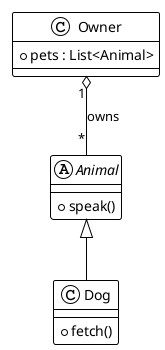

# Generating Diagrams from Existing Source Code

Use when the user points at real code and asks for a diagram *of it* —
"class diagram of this module", "sequence diagram for this request handler",
"component map of the repo", "ER diagram from these models".

**Core rule: read the code, don't guess.** Open the files, extract the real
entities and relationships, and draw only what is actually there — mark
anything inferred. Then render + validate via the normal Workflow Step 4–5 loop.

## Pick the diagram type from the code shape

| What you're looking at | Diagram | Map to PlantUML |
|---|---|---|
| Classes / structs / interfaces | Class | each type → `class`; fields & methods → members; `extends` → `--\|>`; `implements` → `..\|>`; a held field → `*--` / `-->` |
| One request / handler / call path | Sequence | each object or service → `participant`; each call → `->`; each return → `-->` |
| Modules / packages / imports | Component | each module → `component` or `package`; each import/dependency → `-->` |
| ORM models / SQL DDL | ER | each table or model → `entity`; columns → attributes; foreign keys → crow's-foot relations |
| A status enum + transition functions | State | each status → a state; each transition → a labeled edge |

## Steps

1. **Read** the relevant files with the file/search tools — never infer structure from file names alone.
2. **Extract** entities + relationships into a short list and sanity-check it against the code before drawing.
3. **Emit** `.puml` from that list, preserving the real identifiers. Keep member signatures concise (drop method bodies).
4. **Scope large inputs** — one module/package per diagram. Split rather than cram (see `large-diagram-patterns` thinking); a 40-class god-diagram helps no one.
5. **Render + validate** — Workflow Step 4–5.

## Example — Python classes → class diagram

```python
class Animal:
    def speak(self): ...

class Dog(Animal):
    def fetch(self): ...

class Owner:
    def __init__(self):
        self.pets: list[Animal] = []
```

→


