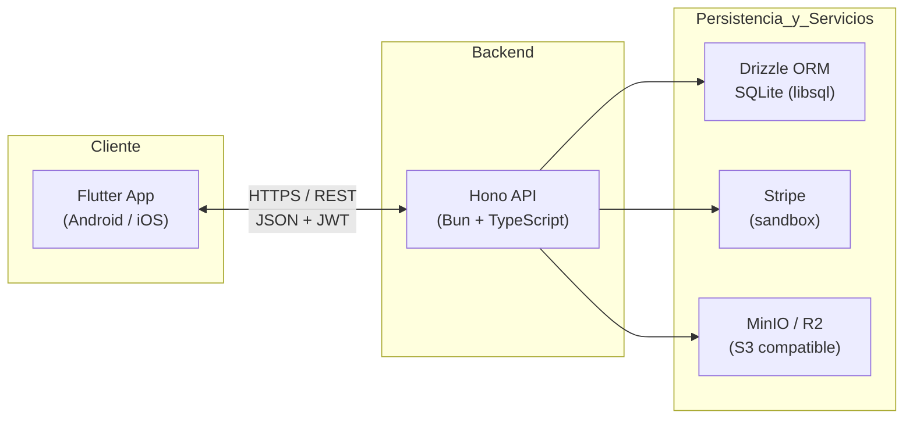
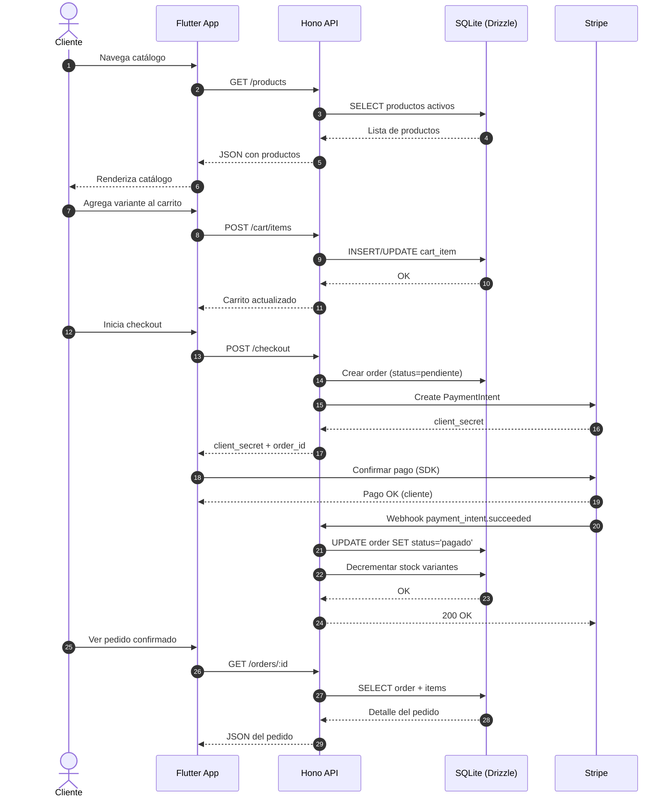

# Introducción

Este documento define el alcance, los objetivos y los requisitos del proyecto **SmartPyME**, una plataforma digital móvil dirigida a pequeñas y medianas empresas (PYMES) del sector comercio minorista, específicamente tiendas de ropa. El proyecto surge como respuesta a la brecha identificada en el análisis bibliométrico sobre transformación digital en PYMES, donde se evidencia la necesidad de soluciones modulares, accesibles y de bajo costo que faciliten la digitalización de ventas y la atención al cliente.

## Propósito

El propósito de este documento es establecer una referencia contractual y funcional que permita alinear las expectativas del equipo de desarrollo, los stakeholders y el cliente en torno al producto a entregar.

- Como este documento debe definir el alcance, los objetivos y los requisitos del proyecto SmartPyME.
- Como este documento debe estar dirigido al equipo de desarrollo, a los stakeholders y al cliente final.
- Como este documento debe servir como base para las fases de diseño, implementación, pruebas y aceptación del MVP.
- Como este documento debe ser la base para la sustentación técnica y la presentación final del proyecto integrador.

## Alcance

SmartPyME es una aplicación móvil multiplataforma (Android/iOS) acompañada de una API REST, orientada a digitalizar las operaciones de venta y atención al cliente de una tienda de ropa minorista. El MVP contempla los módulos de autenticación, catálogo de productos, carrito de compras, procesamiento de pagos, gestión de pedidos, inventario, atención al cliente mediante chatbot y dashboard de analítica de ventas.

- Como este producto debe permitir a una tienda de ropa gestionar su catálogo digital de productos con variantes (talla y color).
- Como este producto debe permitir a los clientes navegar el catálogo, agregar productos al carrito y pagar mediante Stripe.
- Como este producto debe permitir al dueño de la tienda visualizar métricas de ventas y gestionar los pedidos recibidos.

### Incluye

La primera versión entregable (MVP) contempla los siguientes elementos:

- Como este módulo debe permitir el registro e inicio de sesión del administrador de la tienda mediante correo y contraseña.
- Como este módulo debe permitir el inicio de sesión opcional de clientes y la compra como invitado (guest checkout).
- Como este módulo debe permitir la gestión CRUD de categorías, productos, variantes e imágenes.
- Como este módulo debe permitir la carga de imágenes de producto a un storage S3-compatible (MinIO o R2).
- Como este módulo debe permitir la navegación del catálogo con filtros por categoría y búsqueda por nombre.
- Como este módulo debe permitir la gestión de un carrito de compras persistente.
- Como este módulo debe permitir el procesamiento de pagos mediante Stripe en modo sandbox.
- Como este módulo debe permitir la gestión de pedidos con flujo de estados (pendiente, pagado, enviado, entregado).
- Como este módulo debe permitir el control de inventario con alertas de stock bajo y decremento automático tras pago confirmado.
- Como este módulo debe permitir la atención al cliente mediante un chatbot con base de conocimiento local.
- Como este módulo debe permitir la creación y gestión de tickets de soporte.
- Como este módulo debe permitir la visualización de un dashboard de ventas con métricas clave.

### No incluye

Quedan explícitamente fuera del alcance de esta versión:

- Como este producto no debe incluir arquitectura multi-tenant ni gestión de múltiples tiendas en una misma instalación.
- Como este producto no debe incluir comunicación en tiempo real mediante WebSockets para el chat.
- Como este producto no debe incluir notificaciones push a dispositivos móviles.
- Como este producto no debe incluir sistema de reseñas, calificaciones o comentarios de productos.
- Como este producto no debe incluir programa de fidelización, cupones ni descuentos.
- Como este producto no debe incluir soporte multi-idioma (la app se entrega en español).
- Como este producto no debe incluir integración con operadores logísticos ni seguimiento de envíos.
- Como este producto no debe incluir pasarela de pago real en producción (solo sandbox de Stripe).
- Como este producto no debe incluir panel de administración web (la gestión se realiza desde la propia app móvil).

## Definiciones y acrónimos

| Término | Definición |
| ------- | ---------- |
| API | Application Programming Interface. Interfaz de programación de aplicaciones. |
| CRUD | Create, Read, Update, Delete. Operaciones básicas de persistencia. |
| DTO | Data Transfer Object. Objeto utilizado para transportar datos entre capas. |
| E2E | End-to-End. Pruebas que validan un flujo completo de usuario. |
| ERP | Enterprise Resource Planning. Sistema de planificación de recursos empresariales. |
| IA | Inteligencia Artificial. |
| JWT | JSON Web Token. Estándar para tokens de autenticación. |
| MVP | Minimum Viable Product. Producto mínimo viable. |
| ORM | Object-Relational Mapping. Técnica de mapeo entre objetos y bases de datos relacionales. |
| PYME | Pequeña y Mediana Empresa. |
| REST | Representational State Transfer. Estilo de arquitectura para servicios web. |
| RNF | Requisito No Funcional. |
| S3 | Simple Storage Service. Protocolo de almacenamiento de objetos. |
| SDK | Software Development Kit. |
| SKU | Stock Keeping Unit. Unidad de mantenimiento de stock. |
| SSL/TLS | Secure Sockets Layer / Transport Layer Security. Protocolos de seguridad. |
| UI/UX | User Interface / User Experience. |

## Referencias

- Como referencia debe incluirse la documentación oficial de Bun: https://bun.sh/docs
- Como referencia debe incluirse la documentación oficial de Hono: https://hono.dev
- Como referencia debe incluirse la documentación oficial de Drizzle ORM: https://orm.drizzle.team
- Como referencia debe incluirse la documentación oficial de Zod: https://zod.dev
- Como referencia debe incluirse la documentación oficial de Flutter: https://docs.flutter.dev
- Como referencia debe incluirse la documentación oficial de Stripe API: https://stripe.com/docs/api
- Como referencia debe incluirse la documentación del protocolo S3 y la consola de MinIO: https://min.io/docs
- Como referencia debe incluirse el artículo bibliométrico "Transformación Digital y Plataformas Inteligentes para PYMES" elaborado por el equipo.


# Descripción general

## Contexto del producto

SmartPyME se ubica en el segmento de plataformas SaaS móviles para comercio minorista independiente. Responde a la problemática identificada en el análisis bibliométrico: las PYMES presentan baja adopción tecnológica y carecen de herramientas accesibles que les permitan digitalizar ventas y atención al cliente sin incurrir en los costos y la complejidad de soluciones empresariales tradicionales.

- Como este producto debe estar embebido en una arquitectura cliente-servidor con aplicación móvil Flutter consumiendo una API REST.
- Como este producto debe resolver la problemática de digitalización de ventas y atención al cliente en PYMES de comercio minorista textil.
- Como este producto debe reemplazar el uso de herramientas informales (WhatsApp, hojas de cálculo, cuadernos físicos) por un canal digital unificado.
- Como este producto debe complementar al mostrador físico de la tienda, no sustituirlo.

## Objetivos del negocio

- Como este producto debe reducir el tiempo de gestión de catálogo y pedidos del dueño de la PYME en al menos un 50% respecto al proceso manual.
- Como este producto debe ofrecer un canal de venta digital operativo en menos de 2 horas desde la configuración inicial.
- Como este producto debe mantener un costo de operación accesible mediante el uso de servicios en su mayoría gratuitos o de bajo costo.
- Como este producto debe permitir al dueño tomar decisiones informadas mediante un dashboard con métricas de ventas en tiempo real.
- Como este producto debe mejorar la experiencia del cliente final mediante un catálogo visual, un proceso de compra simplificado y atención 24/7 mediante chatbot.

## Tipos de usuarios

| Rol | Descripción |
| --- | ----------- |
| Administrador (Owner) | Dueño o encargado de la tienda. Acceso completo: gestiona catálogo, productos, pedidos, inventario, tickets y visualiza el dashboard. |
| Cliente (Customer) | Persona que navega el catálogo, agrega productos al carrito, realiza pagos y consulta al chatbot. Puede registrarse opcionalmente o comprar como invitado. |

- Como debe existir un rol de Administrador con acceso completo a la gestión de la tienda.
- Como debe existir un rol de Cliente con acceso al catálogo, carrito, checkout y atención al cliente.

## Restricciones

- Como el proyecto debe limitarse al stack definido: Bun + Hono + Drizzle + Zod en el backend, Flutter en el cliente, SQLite como base de datos, MinIO/R2 como storage y Stripe en modo sandbox.
- Como el proyecto debe cumplir con la normativa de protección de datos personales aplicable (no almacenar datos sensibles sin cifrado).
- Como el proyecto debe respetar el plazo y alcance del curso, priorizando un MVP funcional sobre características avanzadas.
- Como el proyecto debe operar íntegramente en español.
- Como la primera versión debe ser single-tenant: una sola tienda por despliegue de backend.

## Supuestos y dependencias

- Como se asume que el equipo de desarrollo dispone de conocimientos en TypeScript, Dart, Flutter, SQL y consumo de APIs REST.
- Como se asume que el dueño de la tienda proporciona el catálogo inicial de productos con imágenes, descripciones, tallas, colores y precios.
- Como se asume que se dispone de conexión a internet para acceder a Stripe, el storage S3 y la descarga de dependencias.
- Como se depende de la disponibilidad de las APIs externas de Stripe para el procesamiento de pagos.
- Como se depende de la disponibilidad del servicio de storage S3-compatible configurado.
- Como se asume que el dispositivo móvil del cliente cumple con los requisitos mínimos de la app (Android 8+ o iOS 12+).
- Como se asume que se cuenta con un entorno de desarrollo con Bun, Flutter SDK, Docker (para MinIO) y Android Studio o Xcode instalados.


# Requisitos funcionales

## RF-001 Registro de administrador

**Descripción:**

Permite al dueño de la tienda crear una cuenta de administrador para acceder al backend de gestión. El sistema debe validar que el correo no esté previamente registrado y almacenar la contraseña mediante un algoritmo de hash seguro.

- Como el sistema debe permitir el registro de un único administrador por despliegue.
- Como el sistema debe validar que el correo electrónico tenga formato válido y no exista previamente.
- Como el sistema debe almacenar la contraseña utilizando bcrypt con un factor de costo mínimo de 10.
- Como el sistema debe responder con un mensaje claro cuando el correo ya esté registrado.

**Prioridad:** Alta

**Criterios de aceptación:**

- Como debe aceptarse un correo válido y una contraseña con al menos 8 caracteres.
- Como debe rechazarse un correo con formato inválido mostrando un mensaje claro.
- Como debe rechazarse un correo duplicado mostrando un mensaje claro.
- Como debe rechazarse una contraseña con menos de 8 caracteres mostrando un mensaje claro.
- Como debe persistirse el hash de la contraseña, nunca la contraseña en texto plano.

## RF-002 Inicio de sesión de administrador

**Descripción:**

Permite al administrador autenticarse y obtener un token JWT que será utilizado en las llamadas subsiguientes a endpoints protegidos.

- Como el sistema debe autenticar al administrador mediante correo y contraseña.
- Como el sistema debe generar un JWT firmado con expiración de 7 días.
- Como el sistema debe devolver el token y los datos básicos del usuario en la respuesta.
- Como el sistema debe rechazar credenciales inválidas con un mensaje genérico que no revele si el correo existe.

**Prioridad:** Alta

**Criterios de aceptación:**

- Como debe aceptarse credenciales válidas y devolver un JWT válido.
- Como debe rechazarse credenciales inválidas con código HTTP 401.
- Como debe rechazarse la petición si el cuerpo no incluye los campos requeridos.
- Como el token debe incluir el identificador de usuario y su rol en los claims.

## RF-003 Inicio de sesión de cliente

**Descripción:**

Permite a los clientes registrarse e iniciar sesión para guardar su historial de pedidos y datos de envío. El registro es opcional y siempre debe existir la alternativa de compra como invitado (guest checkout).

- Como el sistema debe permitir el registro de clientes con correo, nombre, teléfono y contraseña.
- Como el sistema debe permitir el inicio de sesión del cliente con credenciales propias.
- Como el sistema debe permitir al cliente navegar, comprar y consultar el chatbot sin necesidad de autenticarse.
- Como el sistema debe generar un JWT independiente del administrador con los claims apropiados.

**Prioridad:** Alta

**Criterios de aceptación:**

- Como debe aceptarse el registro de un cliente con datos válidos.
- Como debe aceptarse el flujo de compra completa sin autenticación del cliente.
- Como debe rechazarse un correo de cliente duplicado.
- Como debe persistirse el historial de pedidos al cliente autenticado y permitir su consulta posterior.

## RF-004 Gestión de categorías

**Descripción:**

Permite al administrador crear, listar, editar y eliminar categorías de productos (por ejemplo: camisas, pantalones, vestidos, accesorios).

- Como el sistema debe permitir operaciones CRUD sobre categorías.
- Como el sistema debe generar un slug único a partir del nombre de la categoría.
- Como el sistema debe impedir eliminar una categoría que tenga productos asociados.

**Prioridad:** Media

**Criterios de aceptación:**

- Como debe aceptarse la creación de una categoría con nombre único.
- Como debe rechazarse la creación de una categoría con nombre duplicado.
- Como debe listarse todas las categorías activas con su total de productos.
- Como debe rechazarse la eliminación de una categoría con productos asociados.

## RF-005 Gestión de productos

**Descripción:**

Permite al administrador registrar, editar, listar y eliminar productos del catálogo. Cada producto debe tener nombre, descripción, precio, categoría, estado activo/inactivo e imágenes.

- Como el sistema debe permitir operaciones CRUD sobre productos.
- Como el sistema debe validar que el precio sea mayor a 0.
- Como el sistema debe permitir asociar el producto a una categoría existente.
- Como el sistema debe permitir activar o desactivar un producto sin eliminarlo.
- Como el sistema debe generar un slug único a partir del nombre del producto.

**Prioridad:** Alta

**Criterios de aceptación:**

- Como debe aceptarse la creación de un producto con todos los campos obligatorios completos.
- Como debe rechazarse la creación si el precio es 0 o negativo.
- Como debe aceptarse la desactivación de un producto y ocultarse del catálogo público.
- Como debe listarse los productos con paginación y filtros por categoría.

## RF-006 Gestión de variantes de producto

**Descripción:**

Permite al administrador gestionar las variantes de cada producto (combinaciones de talla y color) con su SKU y stock individuales.

- Como el sistema debe permitir asociar múltiples variantes (talla, color) a un producto.
- Como el sistema debe calcular el stock total del producto a partir de la suma del stock de sus variantes.
- Como el sistema debe impedir crear variantes duplicadas (mismo producto + misma talla + mismo color).

**Prioridad:** Alta

**Criterios de aceptación:**

- Como debe aceptarse la creación de variantes con combinaciones únicas.
- Como debe rechazarse la creación de variantes duplicadas.
- Como debe actualizarse el stock total al modificarse el stock de cualquier variante.
- Como debe aceptarse la consulta del stock por variante.

## RF-007 Carga de imágenes de producto

**Descripción:**

Permite al administrador subir imágenes de producto a un storage S3-compatible (MinIO o Cloudflare R2) y asociarlas al producto.

- Como el sistema debe aceptar imágenes en formato JPG, PNG o WebP.
- Como el sistema debe rechazar imágenes mayores a 5 MB.
- Como el sistema debe almacenar la URL pública del storage y asociarla al producto.
- Como el sistema debe permitir reordenar las imágenes (principal, secundarias).

**Prioridad:** Alta

**Criterios de aceptación:**

- Como debe aceptarse la carga de imágenes válidas y devolver la URL pública.
- Como debe rechazarse formatos no soportados con un mensaje claro.
- Como debe rechazarse imágenes mayores a 5 MB.
- Como debe aceptarse la asociación de múltiples imágenes a un mismo producto.

## RF-008 Navegación del catálogo público

**Descripción:**

Permite a los clientes visualizar el catálogo de productos con paginación, filtros por categoría y búsqueda por nombre.

- Como el sistema debe devolver la lista de productos activos con paginación (por defecto 20 por página).
- Como el sistema debe permitir filtrar productos por categoría.
- Como el sistema debe permitir buscar productos por coincidencia parcial en el nombre.
- Como el sistema debe incluir la URL de la imagen principal y el precio mínimo en la respuesta.

**Prioridad:** Alta

**Criterios de aceptación:**

- Como debe listarse únicamente productos activos.
- Como deben devolverse los productos filtrados por categoría.
- Como deben devolverse los productos coincidentes con el término de búsqueda.
- Como debe respetarse la paginación solicitada.

## RF-009 Visualización del detalle de producto

**Descripción:**

Permite al cliente ver toda la información de un producto, incluyendo imágenes, descripción, precio, variantes disponibles (talla y color) y stock por variante.

- Como el sistema debe devolver el detalle completo de un producto activo.
- Como el sistema debe incluir todas las imágenes y todas las variantes con su stock.
- Como el sistema debe devolver HTTP 404 si el producto no existe o está inactivo.

**Prioridad:** Alta

**Criterios de aceptación:**

- Como debe aceptarse la consulta de un producto existente y activo.
- Como debe rechazarse la consulta de un producto inexistente o inactivo.
- Como debe incluirse la información de variantes con stock disponible.

## RF-010 Gestión del carrito de compras

**Descripción:**

Permite al cliente agregar, modificar cantidades, eliminar productos y vaciar el carrito. El carrito debe ser persistente (asociado al cliente si está autenticado, o a un session_id si es invitado).

- Como el sistema debe permitir agregar un producto variante con cantidad al carrito.
- Como el sistema debe permitir modificar la cantidad de un item del carrito.
- Como el sistema debe permitir eliminar un item del carrito.
- Como el sistema debe permitir vaciar el carrito completo.
- Como el sistema debe calcular el subtotal y el total del carrito en cada operación.

**Prioridad:** Alta

**Criterios de aceptación:**

- Como debe aceptarse agregar productos con stock disponible.
- Como debe rechazarse agregar una cantidad mayor al stock disponible.
- Como debe aceptarse la actualización de cantidades y reflejarse en el total.
- Como debe aceptarse la eliminación de items individuales y del carrito completo.

## RF-011 Proceso de checkout y pago con Stripe

**Descripción:**

Permite al cliente iniciar el proceso de checkout, donde se crea una sesión de pago en Stripe (modo sandbox) y se redirige al cliente a la interfaz de pago.

- Como el sistema debe crear un PaymentIntent de Stripe con el monto total del carrito.
- Como el sistema debe crear una orden en estado "pendiente" asociada al cliente y al PaymentIntent.
- Como el sistema debe devolver el client_secret para confirmar el pago desde la app móvil.
- Como el sistema debe recibir el webhook de Stripe para confirmar el pago y actualizar el estado de la orden.

**Prioridad:** Alta

**Criterios de aceptación:**

- Como debe crearse la orden y el PaymentIntent al iniciar el checkout.
- Como debe aceptarse el pago de prueba con tarjeta 4242 4242 4242 4242 en modo sandbox.
- Como debe rechazarse el checkout si el carrito está vacío.
- Como debe actualizarse el estado de la orden a "pagado" al recibir el webhook de Stripe.
- Como debe rechazarse pagos con fondos insuficientes (tarjeta 4000 0000 0000 9995).

## RF-012 Gestión de pedidos por el administrador

**Descripción:**

Permite al administrador visualizar todos los pedidos, filtrarlos por estado, ver su detalle y actualizar su estado conforme avanza el flujo logístico.

- Como el sistema debe listar los pedidos con paginación y filtros por estado y fecha.
- Como el sistema debe permitir ver el detalle completo del pedido (cliente, items, dirección, pago).
- Como el sistema debe permitir cambiar el estado de un pedido respetando la secuencia: pendiente → pagado → enviado → entregado.
- Como el sistema debe permitir cancelar un pedido solo si está en estado "pendiente" o "pagado".

**Prioridad:** Alta

**Criterios de aceptación:**

- Como debe listarse los pedidos con los filtros solicitados.
- Como debe aceptarse el cambio de estado en orden secuencial.
- Como debe rechazarse un cambio de estado que rompa la secuencia permitida.
- Como debe aceptarse la cancelación de pedidos en estado pendiente o pagado.

## RF-013 Historial de pedidos del cliente

**Descripción:**

Permite al cliente autenticado consultar su historial de pedidos y el detalle de cada uno.

- Como el sistema debe devolver únicamente los pedidos del cliente autenticado.
- Como el sistema debe incluir el estado actual y los items de cada pedido.

**Prioridad:** Media

**Criterios de aceptación:**

- Como debe aceptarse la consulta del historial propio.
- Como debe rechazarse cualquier intento de consultar pedidos de otro cliente.
- Como debe incluirse el detalle completo de cada pedido.

## RF-014 Control automático de inventario

**Descripción:**

Al confirmarse el pago de un pedido (vía webhook de Stripe), el sistema debe decrementar automáticamente el stock de las variantes correspondientes. Si alguna variante no tiene stock suficiente, el pedido debe marcarse como fallido y notificarse al cliente.

- Como el sistema debe decrementar el stock de cada variante al confirmarse el pago.
- Como el sistema debe operar de forma atómica para evitar condiciones de carrera.
- Como el sistema debe marcar el pedido como "fallido" si alguna variante no tiene stock suficiente.
- Como el sistema debe enviar una notificación al cliente en caso de fallo de stock.

**Prioridad:** Alta

**Criterios de aceptación:**

- Como debe decrementarse el stock de las variantes tras la confirmación del pago.
- Como debe rechazarse la operación si alguna variante no tiene stock y revertir cualquier cambio parcial.
- Como debe actualizarse el estado del pedido a "fallido" y notificar al cliente.

## RF-015 Alertas de stock bajo

**Descripción:**

El sistema debe generar alertas automáticas cuando el stock de una variante caiga por debajo de un umbral configurable (por defecto 5 unidades).

- Como el sistema debe comparar el stock actual contra el umbral tras cualquier operación que lo modifique.
- Como el sistema debe registrar la alerta en una tabla o panel del dashboard.
- Como el sistema debe permitir al administrador configurar el umbral por variante o globalmente.

**Prioridad:** Media

**Criterios de aceptación:**

- Como debe generarse una alerta cuando el stock de una variante caiga por debajo del umbral.
- Como deben listarse las alertas activas en el dashboard del administrador.

## RF-016 Chatbot de atención al cliente

**Descripción:**

Proporciona un asistente conversacional con IA local basado en una base de conocimiento (FAQ) y búsqueda por palabras clave. El chatbot debe responder preguntas frecuentes sobre la tienda, productos, tallas, envíos y devoluciones.

- Como el chatbot debe recibir un mensaje del cliente y devolver una respuesta.
- Como el chatbot debe buscar coincidencias en la base de conocimiento por palabras clave.
- Como el chatbot debe registrar el historial de la conversación.
- Como el chatbot debe transferir al cliente a un ticket humano cuando no encuentre respuesta.

**Prioridad:** Media

**Criterios de aceptación:**

- Como debe aceptarse un mensaje de texto y devolver una respuesta relevante.
- Como debe persistirse el historial de conversación por cliente o sesión.
- Como debe crearse un ticket automáticamente cuando la confianza de la respuesta sea baja.
- Como debe responder de forma coherente a preguntas registradas en la base de conocimiento.

## RF-017 Gestión de tickets de soporte

**Descripción:**

Permite a los clientes crear tickets de soporte y al administrador gestionarlos (listar, responder, cambiar estado).

- Como el sistema debe permitir al cliente crear un ticket con asunto y descripción.
- Como el sistema debe permitir al administrador listar tickets y filtrarlos por estado.
- Como el sistema debe permitir al administrador responder un ticket y cambiar su estado (abierto, en_progreso, cerrado).

**Prioridad:** Media

**Criterios de aceptación:**

- Como debe aceptarse la creación de un ticket con los campos obligatorios.
- Como debe listarse los tickets con sus estados.
- Como debe aceptarse la respuesta del administrador y reflejarse en el hilo del ticket.

## RF-018 Dashboard de ventas y analítica

**Descripción:**

Proporciona al administrador una vista consolidada de las métricas clave del negocio: ventas totales, número de pedidos, ticket promedio, productos más vendidos, ventas por categoría y evolución temporal.

- Como el sistema debe calcular las ventas totales y el número de pedidos en un rango de fechas.
- Como el sistema debe identificar los productos más vendidos en un período.
- Como el sistema debe mostrar la distribución de pedidos por estado.
- Como el sistema debe permitir filtrar las métricas por día, semana, mes o rango personalizado.

**Prioridad:** Alta

**Criterios de aceptación:**

- Como deben devolverse las métricas solicitadas con precisión en el rango indicado.
- Como deben incluirse los top 5 productos más vendidos.
- Como debe graficarse la evolución temporal de ventas.


# Requisitos no funcionales

## RNF-001 Rendimiento y tiempo de respuesta

- Como el sistema debe responder a las peticiones GET en menos de 200 ms bajo carga normal (percentil 95).
- Como el sistema debe responder a las peticiones POST/PUT en menos de 500 ms bajo carga normal.
- Como el sistema debe soportar al menos 100 usuarios concurrentes sin degradación significativa.

## RNF-002 Seguridad

- Como el sistema debe servir tráfico exclusivamente sobre HTTPS en producción.
- Como el sistema debe almacenar contraseñas mediante bcrypt con factor de costo mínimo 10.
- Como el sistema debe firmar los tokens JWT con un secreto robusto y validar la firma en cada petición.
- Como el sistema debe validar y sanitizar todas las entradas con Zod antes de procesarlas.
- Como el sistema debe implementar rate limiting en los endpoints de autenticación (máximo 5 intentos por minuto por IP).
- Como el sistema debe aplicar el principio de mínimo privilegio: un cliente solo puede acceder a sus propios recursos.

## RNF-003 Disponibilidad y resiliencia

- Como el sistema debe mantener una disponibilidad objetivo del 99% durante el período de evaluación.
- Como el backend debe manejar errores no controlados con un middleware global que devuelva respuestas estructuradas.
- Como la base de datos debe contar con backups automáticos diarios en desarrollo.

## RNF-004 Compatibilidad

- Como la aplicación móvil debe ser compatible con Android 8.0 (API 26) o superior.
- Como la aplicación móvil debe ser compatible con iOS 12.0 o superior.
- Como la API REST debe ser consumible desde cualquier cliente HTTP que respete el contrato OpenAPI documentado.

## RNF-005 Escalabilidad

- Como la arquitectura del backend debe permitir migrar de SQLite a PostgreSQL con cambios mínimos mediante Drizzle.
- Como los módulos del backend deben estar organizados para soportar la adición de nuevas funcionalidades sin refactorización mayor.

## RNF-006 Usabilidad

- Como la aplicación debe contar con un onboarding inicial para el administrador con los pasos de configuración básicos.
- Como la interfaz debe seguir las guías de Material Design 3 en Android y Human Interface Guidelines en iOS.
- Como las acciones críticas (pago, eliminación) deben solicitar confirmación explícita al usuario.

## RNF-007 Mantenibilidad

- Como el código del backend debe estar organizado por módulos (auth, products, orders, cart, etc.) con responsabilidades claras.
- Como el código debe tiparse estrictamente en TypeScript tanto en backend como en cliente.
- Como deben existir migraciones versionadas de Drizzle para evolucionar el esquema de base de datos.

## RNF-008 Observabilidad

- Como el backend debe registrar logs estructurados de peticiones, errores y eventos de negocio.
- Como los logs deben incluir timestamp, nivel, endpoint, identificador de petición y mensaje.

## RNF-009 Portabilidad

- Como el backend debe poder ejecutarse con un único comando (`bun run dev`) tras clonar el repositorio.
- Como debe proporcionarse un `docker-compose.yml` para levantar MinIO y demás servicios auxiliares.
- Como el proyecto debe incluir un README con instrucciones claras de instalación y ejecución.


# Modelo de datos

## Entidades principales

- **users:** id (uuid), email (único), password_hash, name, role (admin/customer), created_at, updated_at.
- **customers:** id (uuid), email, name, phone, default_address, created_at, updated_at.
- **categories:** id (uuid), name (único), slug (único), description, is_active, created_at, updated_at.
- **products:** id (uuid), name, slug (único), description, base_price, category_id (fk), is_active, created_at, updated_at.
- **product_variants:** id (uuid), product_id (fk), size, color, sku (único), stock, additional_price, created_at, updated_at.
- **product_images:** id (uuid), product_id (fk), url, position, created_at.
- **carts:** id (uuid), customer_id (fk, opcional), session_id, status (active/abandoned/converted), created_at, updated_at.
- **cart_items:** id (uuid), cart_id (fk), product_variant_id (fk), quantity, unit_price_snapshot, created_at, updated_at.
- **orders:** id (uuid), customer_id (fk, opcional), guest_email, guest_name, guest_phone, shipping_address, total, status (pendiente/pagado/enviado/entregado/cancelado/fallido), stripe_payment_intent_id, created_at, updated_at.
- **order_items:** id (uuid), order_id (fk), product_variant_id (fk), quantity, unit_price, subtotal, created_at.
- **payments:** id (uuid), order_id (fk), amount, currency, status, stripe_charge_id, method, created_at.
- **chat_sessions:** id (uuid), customer_id (fk, opcional), session_id, started_at, ended_at.
- **chat_messages:** id (uuid), chat_session_id (fk), role (user/bot), content, confidence_score, created_at.
- **support_tickets:** id (uuid), customer_id (fk, opcional), guest_email, subject, description, status (abierto/en_progreso/cerrado), priority (baja/media/alta), assigned_to (fk users), created_at, updated_at.
- **ticket_messages:** id (uuid), ticket_id (fk), sender_type (customer/admin), sender_id, content, created_at.
- **faqs:** id (uuid), question, answer, keywords (json), category, is_active, created_at, updated_at.
- **stock_alerts:** id (uuid), product_variant_id (fk), threshold, current_stock, is_resolved, created_at, resolved_at.
- **sessions:** id (uuid), customer_id (fk, opcional), refresh_token_hash, expires_at, created_at.

- Como debe existir una entidad que represente al usuario con rol diferenciador entre administrador y cliente.
- Como debe existir una entidad que represente el producto con sus variantes e imágenes asociadas.
- Como debe existir una entidad que represente el pedido con sus items y pago asociado.
- Como debe existir una entidad que represente la conversación del chatbot con sus mensajes.


# Integraciones

| Sistema | Descripción | Responsable |
| ------- | ----------- | ----------- |
| Stripe (sandbox) | Procesamiento de pagos con tarjeta. Se utiliza el SDK oficial de Stripe en modo test. El backend crea PaymentIntents y recibe webhooks. | Equipo de desarrollo backend |
| MinIO / Cloudflare R2 | Almacenamiento de imágenes de productos. Se utiliza el protocolo S3 mediante el SDK de AWS o el cliente S3 de Bun. | Equipo de desarrollo backend |
| SQLite (libsql) | Base de datos principal. Se accede mediante Drizzle ORM. | Equipo de desarrollo backend |

- Como esta versión no integra sistemas externos adicionales.
- Como las integraciones con servicios de logística o marketing quedan para versiones posteriores.


# Reglas de negocio

| Código | Regla |
| ------ | ----- |
| RN-001 | El stock de cualquier variante no puede ser negativo. Toda operación que intente decrementar por debajo de 0 debe ser rechazada. |
| RN-002 | Un pedido solo puede cambiar de estado en la siguiente secuencia: pendiente → pagado → enviado → entregado. La cancelación solo es válida en estado pendiente o pagado. |
| RN-003 | El precio de cualquier producto debe ser estrictamente mayor a 0. |
| RN-004 | El stock de un producto se calcula como la suma del stock de todas sus variantes activas. |
| RN-005 | El stock se decrementa únicamente al confirmarse el pago mediante el webhook de Stripe, no al crear la orden. |
| RN-006 | El carrito se vacía automáticamente al convertirse en un pedido confirmado. |
| RN-007 | Las imágenes de producto deben ser JPG, PNG o WebP, con un tamaño máximo de 5 MB cada una. |
| RN-008 | Las contraseñas deben tener al menos 8 caracteres. |
| RN-009 | El token JWT expira en 7 días. Tras su expiración, el usuario debe autenticarse nuevamente. |
| RN-010 | Un cliente solo puede consultar y modificar sus propios pedidos, carritos y tickets. El backend debe validar la propiedad del recurso en cada petición. |
| RN-011 | El carrito activo de un cliente es único. Al existir uno, las nuevas adiciones se acumulan sobre el mismo carrito. |
| RN-012 | La suma de los items de un pedido debe coincidir con el total registrado. El backend debe verificar la coherencia antes de crear el PaymentIntent. |
| RN-013 | El chatbot solo responde con información presente en la base de conocimiento. Si la confianza es baja, se ofrece crear un ticket. |
| RN-014 | Un administrador no puede eliminarse a sí mismo si es el único usuario administrador registrado. |
| RN-015 | El slug de un producto o categoría se genera a partir del nombre en minúsculas, sin acentos, con guiones, y debe ser único. |


# Casos de uso

| Código | Nombre | Actor principal | Descripción |
| ------ | ------ | --------------- | ----------- |
| CU-001 | Registrar tienda | Administrador | El dueño crea su cuenta de administrador y configura los datos básicos de la tienda. |
| CU-002 | Iniciar sesión admin | Administrador | El administrador ingresa con sus credenciales y obtiene un JWT para acceder al panel. |
| CU-003 | Crear producto | Administrador | El administrador registra un nuevo producto con sus variantes, imágenes y stock inicial. |
| CU-004 | Actualizar stock | Administrador | El administrador modifica el stock de las variantes de un producto existente. |
| CU-005 | Gestionar pedidos | Administrador | El administrador revisa los pedidos recibidos, cambia su estado y cancela si corresponde. |
| CU-006 | Consultar dashboard | Administrador | El administrador visualiza las métricas de ventas, productos más vendidos y pedidos por estado. |
| CU-007 | Navegar catálogo | Cliente | El cliente visualiza la lista de productos, aplica filtros por categoría y realiza búsquedas. |
| CU-008 | Ver detalle de producto | Cliente | El cliente visualiza la información completa de un producto, incluyendo variantes y stock. |
| CU-009 | Agregar al carrito | Cliente | El cliente selecciona talla, color y cantidad, y agrega el producto a su carrito. |
| CU-010 | Realizar checkout | Cliente | El cliente revisa su carrito, completa sus datos de envío y procede al pago con Stripe. |
| CU-011 | Pagar con tarjeta | Cliente | El cliente introduce los datos de su tarjeta de prueba en el flujo de Stripe y confirma el pago. |
| CU-012 | Consultar chatbot | Cliente | El cliente envía una consulta al chatbot y recibe una respuesta basada en la base de conocimiento. |
| CU-013 | Crear ticket de soporte | Cliente | El cliente crea un ticket con su consulta cuando el chatbot no resuelve su duda. |
| CU-014 | Responder ticket | Administrador | El administrador visualiza los tickets abiertos, responde al cliente y actualiza el estado. |
| CU-015 | Consultar historial de pedidos | Cliente | El cliente autenticado consulta el listado y detalle de sus pedidos anteriores. |


# Criterios de aceptación del proyecto

- Como el usuario administrador debe poder completar el flujo de alta de tienda y primer producto en menos de 2 horas.
- Como el cliente debe poder navegar el catálogo, agregar al carrito y completar un pago de prueba con tarjeta 4242 4242 4242 4242 de forma exitosa.
- Como el sistema debe gestionar el ciclo completo de un pedido: alta, pago, preparación, envío y entrega.
- Como el chatbot debe responder correctamente al menos al 70% de las preguntas registradas en la base de conocimiento de prueba.
- Como debe entregarse el código fuente completo en un repositorio Git con README de instalación.
- Como debe entregarse la aplicación móvil compilada y funcional en un dispositivo Android o emulador.
- Como debe entregarse una demo en vivo que cubra al menos 5 casos de uso principales.
- Como debe entregarse este documento de alcance firmado por el equipo.
- Como debe entregarse una sustentación técnica que justifique la arquitectura, el stack y las decisiones de diseño.


# Riesgos

| Riesgo | Impacto | Probabilidad | Mitigación |
| ------ | ------- | ------------ | ---------- |
| No contar con claves de API de Stripe configuradas en sandbox | Alto | Media | Solicitar las claves con anticipación o usar las claves públicas de prueba documentadas en la guía de Stripe. |
| Complejidad en la configuración de MinIO o R2 | Medio | Media | Proveer un `docker-compose.yml` listo para usar y documentar la conexión paso a paso en el README. |
| Tiempo insuficiente para implementar todos los módulos | Alto | Alta | Priorizar el flujo crítico: catálogo + carrito + pago + pedido. Los módulos secundarios (chatbot, tickets, dashboard) se reducen a un MVP. |
| Inconsistencias en el manejo de stock bajo concurrencia | Alto | Baja | Implementar la operación de decremento de stock como transacción atómica en SQLite. |
| Errores en la integración del webhook de Stripe | Alto | Media | Utilizar la herramienta CLI de Stripe para pruebas locales y validar con eventos sintéticos. |
| Dificultades con la generación de APK en Flutter | Medio | Media | Compilar y probar la app con suficiente anticipación a la presentación final. |
| Pérdida de datos por fallo en SQLite | Alto | Baja | Configurar backups automáticos diarios del archivo `.db` durante el desarrollo. |
| Desconocimiento del SDK de Stripe por parte del equipo | Medio | Media | Capacitarse previamente con la documentación oficial y tutoriales en modo test. |


# Anexos

## Fórmulas o cálculos relevantes

```text
stock_total_producto = SUM(stock) FROM product_variants WHERE product_id = X

subtotal_carrito = SUM(cart_item.quantity * cart_item.unit_price_snapshot) 
                   FROM cart_items WHERE cart_id = X

total_pedido = subtotal_items + costo_envio - descuentos
            (en este MVP, costo_envio = 0 y descuentos = 0)

ticket_promedio = total_ventas / numero_pedidos_pagados
                en el rango de fechas [fecha_inicio, fecha_fin]
```

- Como debe documentarse si la fórmula de cálculo de envío puede evolucionar a versiones futuras.
- Como deben indicarse los valores configurables (umbral de stock bajo, expiración de JWT) y dónde se almacenan.
- Como debe explicarse el significado de cada variable de la fórmula en el código fuente.

## Arquitectura propuesta



Flujo principal de una compra:



- Como el diagrama debe mostrar el flujo principal de información entre cliente, API y servicios externos.
- Como el diagrama debe identificar los componentes clave del sistema.
- Como el diagrama debe incluir las dependencias externas (Stripe y storage S3).
- Como la comunicación entre el cliente Flutter y la API debe realizarse exclusivamente sobre HTTPS con autenticación JWT.

## Fuera de alcance (No requerido)

En esta versión no se implementará:

- Arquitectura multi-tenant con múltiples tiendas en un mismo backend.
- Comunicación en tiempo real con WebSockets.
- Notificaciones push a dispositivos móviles.
- Sistema de reseñas, calificaciones o comentarios.
- Programa de fidelización, cupones o códigos de descuento.
- Soporte multi-idioma (la app se entrega únicamente en español).
- Integración con operadores logísticos o seguimiento de envíos.
- Pasarela de pago real en producción (únicamente modo sandbox de Stripe).
- Panel de administración web (la gestión se realiza desde la app móvil).
- Reportes avanzados en PDF o exportación de datos.

## Limitaciones conocidas

- Como el rendimiento de SQLite puede degradarse con más de 10.000 pedidos simultáneos. Para escalar se recomienda migrar a PostgreSQL.
- Como el chatbot basado en keywords no comprende el lenguaje natural avanzado. Solo responde a preguntas registradas en la base de conocimiento.
- Como el modo sandbox de Stripe no procesa pagos reales ni genera cargos a tarjetas verdaderas.
- Como MinIO local requiere que el servicio esté ejecutándose en el entorno de desarrollo.
- Como el inventario se valida únicamente al confirmar el pago, no al agregar al carrito. Esto puede generar condiciones de carrera en alta concurrencia.
- Como no se realizan copias de seguridad automáticas en producción más allá de las locales del equipo.

## Formatos soportados

| Formato | Soporte | Manejador o parser | Notas |
| ------- | ------- | ------------------ | ----- |
| JPG / JPEG | Sí | Sharp / cliente S3 | Imágenes de producto, máximo 5 MB |
| PNG | Sí | Sharp / cliente S3 | Imágenes de producto, máximo 5 MB |
| WebP | Sí | Sharp / cliente S3 | Imágenes de producto, máximo 5 MB |
| JSON | Sí | Zod (validación de esquema) | Cuerpo de todas las peticiones y respuestas de la API |
| JWT | Sí | Librería `hono/jwt` | Autenticación de usuarios y administradores |

## Glosario visual

La aplicación móvil se organiza en las siguientes áreas principales:

- **Splash y onboarding:** Pantalla inicial con logo de SmartPyME y tres pantallas de presentación para nuevos usuarios.
- **Catálogo (Cliente):** Grid de productos con filtros por categoría, barra de búsqueda y ordenamiento por precio y novedad.
- **Detalle de producto:** Imagen principal, galería, selector de talla y color, cantidad, descripción y botón "Agregar al carrito".
- **Carrito:** Lista de productos agregados con cantidad editable, subtotal, total y botón de checkout.
- **Checkout:** Formulario de datos de envío, resumen del pedido e integración con Stripe Payment Sheet.
- **Confirmación:** Pantalla de éxito tras el pago con número de pedido y opción de seguir comprando.
- **Chatbot:** Burbuja de chat persistente con historial y acceso directo a creación de tickets.
- **Tickets:** Listado de tickets del cliente con estado y opción de crear uno nuevo.
- **Login/Registro:** Formularios separados para administrador y cliente.
- **Panel de administración (Home):** Dashboard con métricas clave, accesos directos a productos, pedidos y tickets.
- **Gestión de productos (Admin):** Lista de productos con búsqueda, botón flotante para crear nuevo, formulario con tabs para datos, variantes e imágenes.
- **Gestión de pedidos (Admin):** Lista de pedidos con filtros por estado, detalle expandible con datos del cliente y controles de cambio de estado.
- **Configuración (Admin):** Umbral de stock, datos de la tienda, versión de la app y cierre de sesión.

- Como cada pantalla debe tener una responsabilidad clara y diferenciada.
- Como la navegación principal debe seguir el patrón bottom navigation bar con 4 pestañas (Inicio, Catálogo, Carrito, Perfil) para el cliente.
- Como el panel de administración debe seguir el patrón bottom navigation bar con 4 pestañas (Dashboard, Productos, Pedidos, Tickets).
- Como el chatbot debe ser accesible desde cualquier pantalla mediante un botón flotante (FAB).
