# Información general

**Proyecto:** SmartPyME — Plataforma Digital Móvil para PYMES de Comercio Minorista

**Versión:** 1.0.0

**Fecha:** Junio 2026

**Motor de base de datos:** SQLite 3 con libsql (modo archivo local, `smartpyme.db`)

**ORM / Driver:** Drizzle ORM + drizzle-kit (migraciones versionadas) sobre `@libsql/client`

**Documentos relacionados:**

- `ARTICULO.md` — Artículo de revisión bibliométrica.
- `ALCANCE.md` — Documento de alcance del proyecto.
- `BACKLOG.md` — Backlog del producto con épicas, historias de usuario y tareas.

- Como la información general debe identificar de forma única la versión del modelo de datos.
- Como el motor de base de datos debe coincidir con la arquitectura del proyecto (SQLite + Drizzle).
- Como toda decisión de diseño del modelo debe ser trazable al documento de alcance y al backlog.


# Objetivo

Este documento define la estructura lógica de la información que utiliza el sistema SmartPyME. Cubre las entidades, atributos, relaciones, restricciones, índices y reglas de negocio necesarias para almacenar y consultar los datos del proyecto de forma consistente, alineado con los requisitos funcionales del documento de alcance y la arquitectura hexagonal del backend.

- Como este documento debe servir como referencia para backend (Drizzle schema), frontend (modelos Freezed) y migración inicial de la base de datos.
- Como este documento debe mantener la consistencia del dominio del negocio (carrito, pedido, inventario, pagos).
- Como todas las entidades deben derivarse del documento de alcance (`ALCANCE.md`).
- Como los diagramas y DDL deben corresponderse con la implementación física final.


# Convenciones

## Convenciones de nombres

- **Tablas:** en plural y `snake_case` (ej. `users`, `product_variants`, `order_items`).
- **Columnas:** en `snake_case` (ej. `first_name`, `stripe_payment_intent_id`).
- **Claves primarias:** siempre como `id` (UUID v4, almacenado como `TEXT` de 36 caracteres).
- **Claves foráneas:** como `{entidad_singular}_id` (ej. `product_id`, `customer_id`).
- **Timestamps:** almacenados como `TEXT` en formato ISO 8601 UTC (`CURRENT_TIMESTAMP`).
- **Booleanos:** almacenados como `INTEGER` con valores `0` (falso) y `1` (verdadero).
- **Moneda:** importes monetarios como `INTEGER` en **centavos** (ej. `2999` = S/ 29.99).
- **JSON:** columnas con datos estructurados como `TEXT` con contenido JSON validado en aplicación.
- **Índices:** prefijo `idx_` para índices de performance, `uq_` para restricciones UNIQUE.
- **Constraints de CHECK:** prefijo `ck_` (ej. `ck_users_role`).

- Como todas las entidades deben seguir la misma convención de nombres.
- Como las claves primarias deben identificarse de forma única mediante UUID v4 generado por aplicación.
- Como las claves foráneas deben mantener la integridad referencial con `ON DELETE` explícito.
- Como las columnas monetarias deben estar siempre en centavos para evitar errores de redondeo.


# Modelo conceptual

El modelo se compone de **13 entidades principales** organizadas en 4 dominios:

| Entidad | Dominio | Descripción |
| ------- | ------- | ----------- |
| `users` | Identidad | Cuentas de administrador y clientes registrados. |
| `categories` | Catálogo | Categorías del catálogo (camisas, jeans, vestidos, accesorios). |
| `products` | Catálogo | Productos del catálogo con precio base, descripción e imágenes. |
| `product_variants` | Catálogo | Combinaciones únicas de talla y color con SKU y stock individual. |
| `product_images` | Catálogo | Imágenes de producto almacenadas en Cloudflare R2. |
| `carts` | Ventas | Carritos de compra asociados a un cliente o a un session_id de invitado. |
| `cart_items` | Ventas | Items dentro de un carrito con snapshot de precio. |
| `orders` | Ventas | Pedidos con estado, total, datos de envío y datos opcionales de invitado. |
| `order_items` | Ventas | Items de un pedido con snapshot de datos del producto. |
| `payments` | Pagos | Pagos procesados a través de Stripe. |
| `stock_movements` | Inventario | Auditoría de cambios de stock (ventas, reposiciones, ajustes). |
| `stock_alerts` | Inventario | Alertas automáticas de stock bajo por variante. |
| `faqs` | Atención (futuro) | Base de conocimiento del chatbot (fuera de v1, esquema preparado). |

- Como cada entidad debe representar un concepto del negocio.
- Como ninguna entidad debe duplicar responsabilidades de otra.


# Entidades

## users

**Descripción:**

Almacena las cuentas de usuario del sistema. Una misma tabla representa tanto a administradores (dueños de tienda) como a clientes registrados, diferenciados por el campo `role`. Los datos de compradores invitados (guest) **no** se almacenan aquí, sino en columnas dedicadas de la entidad `orders`.

### Atributos

| Campo | Tipo SQL | Obligatorio | Default | Descripción |
| ----- | -------- | ----------- | ------- | ----------- |
| `id` | TEXT | Sí | — | Identificador único UUID v4. PK. |
| `email` | TEXT | Sí | — | Correo electrónico único. |
| `password_hash` | TEXT | Sí | — | Hash bcrypt (factor 10) de la contraseña. |
| `name` | TEXT | Sí | — | Nombre completo del usuario. |
| `phone` | TEXT | No | NULL | Teléfono de contacto (opcional). |
| `role` | TEXT | Sí | — | Rol: `admin` o `customer`. CHECK constraint. |
| `default_shipping_address` | TEXT | No | NULL | Dirección de envío por defecto en formato JSON. |
| `is_active` | INTEGER | Sí | 1 | Estado de la cuenta: `1` activo, `0` desactivado. |
| `created_at` | TEXT | Sí | `CURRENT_TIMESTAMP` | Fecha de creación ISO 8601. |
| `updated_at` | TEXT | Sí | `CURRENT_TIMESTAMP` | Fecha de última modificación ISO 8601. |

### Restricciones

- PK: `id`.
- UNIQUE: `email`.
- CHECK: `role IN ('admin', 'customer')`.
- CHECK: `is_active IN (0, 1)`.
- CHECK: `length(password_hash) >= 50` (un hash bcrypt válido).

### Índices

| Nombre | Campos | Tipo |
| ------ | ------ | ---- |
| `pk_users` | `id` | PRIMARY KEY |
| `uq_users_email` | `email` | UNIQUE |
| `idx_users_role` | `role` | INDEX |

### Relaciones

| Entidad | Cardinalidad | Descripción |
| ------- | ------------ | ----------- |
| `carts` | 1:N | Un usuario puede tener múltiples carritos (aunque solo uno activo). |
| `orders` | 1:N | Un usuario (cliente) puede tener múltiples pedidos. |
| `stock_movements` | 1:N (created_by) | Un admin puede registrar múltiples movimientos. |

### Reglas de negocio

- Como el correo debe ser único en toda la tabla (RN derivado de RF-001 y RF-003).
- Como la contraseña debe almacenarse siempre hasheada con bcrypt factor 10 (RNF-002).
- Como solo puede existir un único usuario con `role='admin'` por despliegue (single-tenant, RF-001).
- Como un cliente con `is_active=0` no puede iniciar sesión (derivado de seguridad).

### DDL

```sql
CREATE TABLE users (
  id TEXT PRIMARY KEY NOT NULL,
  email TEXT NOT NULL UNIQUE,
  password_hash TEXT NOT NULL,
  name TEXT NOT NULL,
  phone TEXT,
  role TEXT NOT NULL CHECK (role IN ('admin', 'customer')),
  default_shipping_address TEXT,
  is_active INTEGER NOT NULL DEFAULT 1 CHECK (is_active IN (0, 1)),
  created_at TEXT NOT NULL DEFAULT CURRENT_TIMESTAMP,
  updated_at TEXT NOT NULL DEFAULT CURRENT_TIMESTAMP
);

CREATE INDEX idx_users_role ON users(role);
```

---

## categories

**Descripción:**

Categorías del catálogo de productos (camisas, jeans, vestidos, accesorios). Permiten agrupar productos y aplicar filtros en el catálogo público.

### Atributos

| Campo | Tipo SQL | Obligatorio | Default | Descripción |
| ----- | -------- | ----------- | ------- | ----------- |
| `id` | TEXT | Sí | — | Identificador único UUID v4. PK. |
| `name` | TEXT | Sí | — | Nombre visible de la categoría. |
| `slug` | TEXT | Sí | — | Identificador URL-friendly único. |
| `description` | TEXT | No | NULL | Descripción opcional. |
| `is_active` | INTEGER | Sí | 1 | Estado activo/inactivo. |
| `created_at` | TEXT | Sí | `CURRENT_TIMESTAMP` | Fecha de creación. |
| `updated_at` | TEXT | Sí | `CURRENT_TIMESTAMP` | Fecha de última modificación. |

### Restricciones

- PK: `id`.
- UNIQUE: `name`, `slug`.
- CHECK: `is_active IN (0, 1)`.
- CHECK: `length(slug) > 0` y formato `[a-z0-9-]+` (validado en app).

### Índices

| Nombre | Campos | Tipo |
| ------ | ------ | ---- |
| `pk_categories` | `id` | PRIMARY KEY |
| `uq_categories_name` | `name` | UNIQUE |
| `uq_categories_slug` | `slug` | UNIQUE |

### Relaciones

| Entidad | Cardinalidad | Descripción |
| ------- | ------------ | ----------- |
| `products` | 1:N | Una categoría agrupa múltiples productos. |

### Reglas de negocio

- Como no debe eliminarse una categoría que tenga productos asociados (RN derivado de RF-004).
- Como el `slug` se genera automáticamente desde `name` en minúsculas, sin acentos, con guiones (RN-015).

### DDL

```sql
CREATE TABLE categories (
  id TEXT PRIMARY KEY NOT NULL,
  name TEXT NOT NULL UNIQUE,
  slug TEXT NOT NULL UNIQUE,
  description TEXT,
  is_active INTEGER NOT NULL DEFAULT 1 CHECK (is_active IN (0, 1)),
  created_at TEXT NOT NULL DEFAULT CURRENT_TIMESTAMP,
  updated_at TEXT NOT NULL DEFAULT CURRENT_TIMESTAMP
);
```

---

## products

**Descripción:**

Productos del catálogo disponibles para la venta. Cada producto tiene un precio base (en centavos) y se asocia a una categoría. Las variantes (talla/color) se modelan en `product_variants` y las imágenes en `product_images`.

### Atributos

| Campo | Tipo SQL | Obligatorio | Default | Descripción |
| ----- | -------- | ----------- | ------- | ----------- |
| `id` | TEXT | Sí | — | Identificador único UUID v4. PK. |
| `name` | TEXT | Sí | — | Nombre del producto. |
| `slug` | TEXT | Sí | — | URL-friendly único. |
| `description` | TEXT | No | NULL | Descripción detallada del producto. |
| `base_price` | INTEGER | Sí | — | Precio base en centavos (centavos de sol). |
| `category_id` | TEXT | Sí | — | FK a `categories.id`. |
| `is_active` | INTEGER | Sí | 1 | Si el producto es visible en el catálogo público. |
| `created_at` | TEXT | Sí | `CURRENT_TIMESTAMP` | Fecha de creación. |
| `updated_at` | TEXT | Sí | `CURRENT_TIMESTAMP` | Fecha de última modificación. |

### Restricciones

- PK: `id`.
- UNIQUE: `slug`.
- CHECK: `base_price > 0` (RN-003).
- CHECK: `is_active IN (0, 1)`.
- FK: `category_id REFERENCES categories(id) ON DELETE RESTRICT`.

### Índices

| Nombre | Campos | Tipo |
| ------ | ------ | ---- |
| `pk_products` | `id` | PRIMARY KEY |
| `uq_products_slug` | `slug` | UNIQUE |
| `idx_products_category_active` | `category_id, is_active` | COMPOUND INDEX |
| `idx_products_name` | `name` | INDEX (para búsqueda LIKE) |

### Relaciones

| Entidad | Cardinalidad | Descripción |
| ------- | ------------ | ----------- |
| `categories` | N:1 | Cada producto pertenece a una categoría. |
| `product_variants` | 1:N | Un producto tiene una o más variantes. |
| `product_images` | 1:N | Un producto tiene múltiples imágenes. |

### Reglas de negocio

- Como el precio base debe ser estrictamente mayor a 0 (RN-003).
- Como el stock total del producto es la suma del stock de sus variantes (RN-004).
- Como el `slug` se genera automáticamente desde `name` (RN-015).

### DDL

```sql
CREATE TABLE products (
  id TEXT PRIMARY KEY NOT NULL,
  name TEXT NOT NULL,
  slug TEXT NOT NULL UNIQUE,
  description TEXT,
  base_price INTEGER NOT NULL CHECK (base_price > 0),
  category_id TEXT NOT NULL REFERENCES categories(id) ON DELETE RESTRICT,
  is_active INTEGER NOT NULL DEFAULT 1 CHECK (is_active IN (0, 1)),
  created_at TEXT NOT NULL DEFAULT CURRENT_TIMESTAMP,
  updated_at TEXT NOT NULL DEFAULT CURRENT_TIMESTAMP
);

CREATE INDEX idx_products_category_active ON products(category_id, is_active);
CREATE INDEX idx_products_name ON products(name);
```

---

## product_variants

**Descripción:**

Variantes de un producto definidas por la combinación única de `size` y `color`. Cada variante tiene su propio SKU, stock y precio adicional sobre el precio base del producto.

### Atributos

| Campo | Tipo SQL | Obligatorio | Default | Descripción |
| ----- | -------- | ----------- | ------- | ----------- |
| `id` | TEXT | Sí | — | Identificador único UUID v4. PK. |
| `product_id` | TEXT | Sí | — | FK a `products.id`. |
| `size` | TEXT | Sí | — | Talla (XS, S, M, L, XL, 28, 30, etc.). |
| `color` | TEXT | Sí | — | Color (Rojo, Azul, Negro, etc.). |
| `sku` | TEXT | Sí | — | Stock Keeping Unit único. |
| `stock` | INTEGER | Sí | 0 | Stock disponible (no puede ser negativo). |
| `additional_price` | INTEGER | Sí | 0 | Precio adicional en centavos sobre el `base_price`. |
| `created_at` | TEXT | Sí | `CURRENT_TIMESTAMP` | Fecha de creación. |
| `updated_at` | TEXT | Sí | `CURRENT_TIMESTAMP` | Fecha de última modificación. |

### Restricciones

- PK: `id`.
- UNIQUE: `sku`, `(product_id, size, color)`.
- CHECK: `stock >= 0` (RN-001).
- CHECK: `additional_price >= 0`.
- FK: `product_id REFERENCES products(id) ON DELETE CASCADE`.

### Índices

| Nombre | Campos | Tipo |
| ------ | ------ | ---- |
| `pk_product_variants` | `id` | PRIMARY KEY |
| `uq_product_variants_sku` | `sku` | UNIQUE |
| `uq_product_variants_combo` | `product_id, size, color` | UNIQUE COMPOUND |
| `idx_product_variants_stock` | `stock` | INDEX (para alertas) |

### Relaciones

| Entidad | Cardinalidad | Descripción |
| ------- | ------------ | ----------- |
| `products` | N:1 | Cada variante pertenece a un producto. |
| `cart_items` | 1:N | Una variante puede estar en múltiples carritos. |
| `order_items` | 1:N | Una variante puede estar en múltiples pedidos. |
| `stock_movements` | 1:N | Cada cambio de stock genera un movimiento. |
| `stock_alerts` | 1:N | Una variante puede tener múltiples alertas (histórico). |

### Reglas de negocio

- Como el stock no puede ser negativo bajo ninguna circunstancia (RN-001).
- Como la combinación `(product_id, size, color)` debe ser única (RF-006).
- Como el stock total del producto se calcula como `SUM(product_variants.stock)` (RN-004).

### DDL

```sql
CREATE TABLE product_variants (
  id TEXT PRIMARY KEY NOT NULL,
  product_id TEXT NOT NULL REFERENCES products(id) ON DELETE CASCADE,
  size TEXT NOT NULL,
  color TEXT NOT NULL,
  sku TEXT NOT NULL UNIQUE,
  stock INTEGER NOT NULL DEFAULT 0 CHECK (stock >= 0),
  additional_price INTEGER NOT NULL DEFAULT 0 CHECK (additional_price >= 0),
  created_at TEXT NOT NULL DEFAULT CURRENT_TIMESTAMP,
  updated_at TEXT NOT NULL DEFAULT CURRENT_TIMESTAMP,
  UNIQUE (product_id, size, color)
);

CREATE INDEX idx_product_variants_stock ON product_variants(stock);
```

---

## product_images

**Descripción:**

Imágenes de producto almacenadas en Cloudflare R2. Cada producto puede tener múltiples imágenes ordenadas por el campo `position` (la posición 0 es la imagen principal/portada).

### Atributos

| Campo | Tipo SQL | Obligatorio | Default | Descripción |
| ----- | -------- | ----------- | ------- | ----------- |
| `id` | TEXT | Sí | — | Identificador único UUID v4. PK. |
| `product_id` | TEXT | Sí | — | FK a `products.id`. |
| `url` | TEXT | Sí | — | URL pública del objeto en R2. |
| `position` | INTEGER | Sí | 0 | Orden de la imagen (0 = principal). |
| `created_at` | TEXT | Sí | `CURRENT_TIMESTAMP` | Fecha de creación. |

### Restricciones

- PK: `id`.
- CHECK: `position >= 0`.
- FK: `product_id REFERENCES products(id) ON DELETE CASCADE`.

### Índices

| Nombre | Campos | Tipo |
| ------ | ------ | ---- |
| `pk_product_images` | `id` | PRIMARY KEY |
| `idx_product_images_product_pos` | `product_id, position` | COMPOUND INDEX |

### Relaciones

| Entidad | Cardinalidad | Descripción |
| ------- | ------------ | ----------- |
| `products` | N:1 | Cada imagen pertenece a un producto. |

### Reglas de negocio

- Como un producto puede tener hasta 5 imágenes (regla de negocio derivada del alcance).
- Como la imagen con menor `position` se considera la principal en listados.

### DDL

```sql
CREATE TABLE product_images (
  id TEXT PRIMARY KEY NOT NULL,
  product_id TEXT NOT NULL REFERENCES products(id) ON DELETE CASCADE,
  url TEXT NOT NULL,
  position INTEGER NOT NULL DEFAULT 0 CHECK (position >= 0),
  created_at TEXT NOT NULL DEFAULT CURRENT_TIMESTAMP
);

CREATE INDEX idx_product_images_product_pos ON product_images(product_id, position);
```

---

## carts

**Descripción:**

Carritos de compra. Pueden estar asociados a un cliente registrado (`customer_id`) o a un identificador de sesión anónima (`session_id`) para guest checkout. Solo debe existir un carrito activo por usuario o sesión.

### Atributos

| Campo | Tipo SQL | Obligatorio | Default | Descripción |
| ----- | -------- | ----------- | ------- | ----------- |
| `id` | TEXT | Sí | — | Identificador único UUID v4. PK. |
| `customer_id` | TEXT | No | NULL | FK a `users.id` (solo si es cliente registrado). |
| `session_id` | TEXT | No | NULL | Identificador de sesión para guest. |
| `status` | TEXT | Sí | `active` | Estado: `active`, `abandoned`, `converted`. |
| `created_at` | TEXT | Sí | `CURRENT_TIMESTAMP` | Fecha de creación. |
| `updated_at` | TEXT | Sí | `CURRENT_TIMESTAMP` | Fecha de última modificación. |

### Restricciones

- PK: `id`.
- CHECK: `status IN ('active', 'abandoned', 'converted')`.
- CHECK: `(customer_id IS NOT NULL) OR (session_id IS NOT NULL)` (debe tener al menos uno).
- FK: `customer_id REFERENCES users(id) ON DELETE CASCADE`.

### Índices

| Nombre | Campos | Tipo |
| ------ | ------ | ---- |
| `pk_carts` | `id` | PRIMARY KEY |
| `idx_carts_customer` | `customer_id` | INDEX |
| `idx_carts_session` | `session_id` | INDEX |
| `idx_carts_status` | `status` | INDEX |

### Relaciones

| Entidad | Cardinalidad | Descripción |
| ------- | ------------ | ----------- |
| `users` | N:1 (opcional) | Un carrito pertenece opcionalmente a un usuario. |
| `cart_items` | 1:N | Un carrito contiene múltiples items. |

### Reglas de negocio

- Como un cliente autenticado debe tener un único carrito activo (RN-011).
- Como el carrito se vacía automáticamente al convertirse en un pedido confirmado (RN-006).
- Como el `session_id` se genera en la app y se persiste en almacenamiento local (guest).

### DDL

```sql
CREATE TABLE carts (
  id TEXT PRIMARY KEY NOT NULL,
  customer_id TEXT REFERENCES users(id) ON DELETE CASCADE,
  session_id TEXT,
  status TEXT NOT NULL DEFAULT 'active' CHECK (status IN ('active', 'abandoned', 'converted')),
  created_at TEXT NOT NULL DEFAULT CURRENT_TIMESTAMP,
  updated_at TEXT NOT NULL DEFAULT CURRENT_TIMESTAMP,
  CHECK ((customer_id IS NOT NULL) OR (session_id IS NOT NULL))
);

CREATE INDEX idx_carts_customer ON carts(customer_id);
CREATE INDEX idx_carts_session ON carts(session_id);
CREATE INDEX idx_carts_status ON carts(status);
```

---

## cart_items

**Descripción:**

Items dentro de un carrito. Almacena un snapshot del precio unitario al momento de agregar el producto para evitar inconsistencias si el precio del producto cambia posteriormente.

### Atributos

| Campo | Tipo SQL | Obligatorio | Default | Descripción |
| ----- | -------- | ----------- | ------- | ----------- |
| `id` | TEXT | Sí | — | Identificador único UUID v4. PK. |
| `cart_id` | TEXT | Sí | — | FK a `carts.id`. |
| `product_variant_id` | TEXT | Sí | — | FK a `product_variants.id`. |
| `quantity` | INTEGER | Sí | 1 | Cantidad del producto. |
| `unit_price_snapshot` | INTEGER | Sí | — | Precio unitario en centavos al momento de agregar. |
| `created_at` | TEXT | Sí | `CURRENT_TIMESTAMP` | Fecha de creación. |
| `updated_at` | TEXT | Sí | `CURRENT_TIMESTAMP` | Fecha de última modificación. |

### Restricciones

- PK: `id`.
- UNIQUE: `(cart_id, product_variant_id)` (un producto por carrito).
- CHECK: `quantity > 0`.
- CHECK: `unit_price_snapshot >= 0`.
- FK: `cart_id REFERENCES carts(id) ON DELETE CASCADE`.
- FK: `product_variant_id REFERENCES product_variants(id) ON DELETE RESTRICT`.

### Índices

| Nombre | Campos | Tipo |
| ------ | ------ | ---- |
| `pk_cart_items` | `id` | PRIMARY KEY |
| `uq_cart_items_cart_variant` | `cart_id, product_variant_id` | UNIQUE COMPOUND |
| `idx_cart_items_cart` | `cart_id` | INDEX |

### Relaciones

| Entidad | Cardinalidad | Descripción |
| ------- | ------------ | ----------- |
| `carts` | N:1 | Cada item pertenece a un carrito. |
| `product_variants` | N:1 | Cada item referencia una variante. |

### Reglas de negocio

- Como la cantidad no puede exceder el stock disponible de la variante (RN-001).
- Como el subtotal del item es `quantity * unit_price_snapshot`.
- Como el total del carrito es la suma de los subtotales de los items.

### DDL

```sql
CREATE TABLE cart_items (
  id TEXT PRIMARY KEY NOT NULL,
  cart_id TEXT NOT NULL REFERENCES carts(id) ON DELETE CASCADE,
  product_variant_id TEXT NOT NULL REFERENCES product_variants(id) ON DELETE RESTRICT,
  quantity INTEGER NOT NULL DEFAULT 1 CHECK (quantity > 0),
  unit_price_snapshot INTEGER NOT NULL CHECK (unit_price_snapshot >= 0),
  created_at TEXT NOT NULL DEFAULT CURRENT_TIMESTAMP,
  updated_at TEXT NOT NULL DEFAULT CURRENT_TIMESTAMP,
  UNIQUE (cart_id, product_variant_id)
);

CREATE INDEX idx_cart_items_cart ON cart_items(cart_id);
```

---

## orders

**Descripción:**

Pedidos realizados por clientes (registrados o invitados). Almacena totales, dirección de envío en formato JSON, datos opcionales de invitado y la referencia al PaymentIntent de Stripe. Es la entidad central del flujo de ventas.

### Atributos

| Campo | Tipo SQL | Obligatorio | Default | Descripción |
| ----- | -------- | ----------- | ------- | ----------- |
| `id` | TEXT | Sí | — | Identificador único UUID v4. PK. |
| `customer_id` | TEXT | No | NULL | FK a `users.id` (NULL si es guest). |
| `guest_email` | TEXT | No | NULL | Email del invitado (requerido si `customer_id` es NULL). |
| `guest_name` | TEXT | No | NULL | Nombre del invitado. |
| `guest_phone` | TEXT | No | NULL | Teléfono del invitado. |
| `shipping_address` | TEXT | No | NULL | Dirección de envío en formato JSON. |
| `subtotal` | INTEGER | Sí | — | Subtotal en centavos (suma de items). |
| `total` | INTEGER | Sí | — | Total en centavos (en MVP = subtotal, sin envío ni descuentos). |
| `currency` | TEXT | Sí | `PEN` | Código de moneda ISO 4217. |
| `status` | TEXT | Sí | `pendiente` | Estado del pedido. |
| `stripe_payment_intent_id` | TEXT | No | NULL | Identificador del PaymentIntent en Stripe. UNIQUE. |
| `notes` | TEXT | No | NULL | Notas opcionales del cliente. |
| `created_at` | TEXT | Sí | `CURRENT_TIMESTAMP` | Fecha de creación. |
| `updated_at` | TEXT | Sí | `CURRENT_TIMESTAMP` | Fecha de última modificación. |

### Restricciones

- PK: `id`.
- UNIQUE: `stripe_payment_intent_id` (cuando no es NULL).
- CHECK: `status IN ('pendiente', 'pagado', 'enviado', 'entregado', 'cancelado', 'fallido')`.
- CHECK: `subtotal >= 0`.
- CHECK: `total >= 0`.
- CHECK: `currency IN ('PEN', 'USD')`.
- CHECK: `(customer_id IS NOT NULL) OR (guest_email IS NOT NULL)` (al menos uno).
- FK: `customer_id REFERENCES users(id) ON DELETE SET NULL`.

### Índices

| Nombre | Campos | Tipo |
| ------ | ------ | ---- |
| `pk_orders` | `id` | PRIMARY KEY |
| `uq_orders_payment_intent` | `stripe_payment_intent_id` | UNIQUE |
| `idx_orders_customer_created` | `customer_id, created_at` | COMPOUND INDEX |
| `idx_orders_status_created` | `status, created_at` | COMPOUND INDEX |
| `idx_orders_guest_email` | `guest_email` | INDEX |

### Relaciones

| Entidad | Cardinalidad | Descripción |
| ------- | ------------ | ----------- |
| `users` | N:1 (opcional) | Un pedido pertenece opcionalmente a un cliente. |
| `order_items` | 1:N | Un pedido contiene múltiples items. |
| `payments` | 1:1 | Un pedido tiene un pago asociado. |

### Reglas de negocio

- Como un pedido solo puede cambiar de estado en la secuencia `pendiente → pagado → enviado → entregado` (RN-002).
- Como la cancelación solo es válida en estado `pendiente` o `pagado` (RN-002).
- Como la suma de los items debe coincidir con el `subtotal` registrado (RN-012).
- Como el `shipping_address` se almacena como JSON con la forma `{street, city, state, zip, country, references}`.

### Formato de `shipping_address` (JSON)

```json
{
  "street": "Av. Ejemplo 123",
  "city": "Arequipa",
  "state": "Arequipa",
  "zip": "04001",
  "country": "PE",
  "references": "Frente al parque"
}
```

### DDL

```sql
CREATE TABLE orders (
  id TEXT PRIMARY KEY NOT NULL,
  customer_id TEXT REFERENCES users(id) ON DELETE SET NULL,
  guest_email TEXT,
  guest_name TEXT,
  guest_phone TEXT,
  shipping_address TEXT,
  subtotal INTEGER NOT NULL CHECK (subtotal >= 0),
  total INTEGER NOT NULL CHECK (total >= 0),
  currency TEXT NOT NULL DEFAULT 'PEN' CHECK (currency IN ('PEN', 'USD')),
  status TEXT NOT NULL DEFAULT 'pendiente' CHECK (status IN ('pendiente', 'pagado', 'enviado', 'entregado', 'cancelado', 'fallido')),
  stripe_payment_intent_id TEXT UNIQUE,
  notes TEXT,
  created_at TEXT NOT NULL DEFAULT CURRENT_TIMESTAMP,
  updated_at TEXT NOT NULL DEFAULT CURRENT_TIMESTAMP,
  CHECK ((customer_id IS NOT NULL) OR (guest_email IS NOT NULL))
);

CREATE INDEX idx_orders_customer_created ON orders(customer_id, created_at);
CREATE INDEX idx_orders_status_created ON orders(status, created_at);
CREATE INDEX idx_orders_guest_email ON orders(guest_email);
```

---

## order_items

**Descripción:**

Items de un pedido con snapshot completo del producto y variante. Esto garantiza que el detalle del pedido sea inmutable aunque el producto o variante se modifiquen o eliminen posteriormente.

### Atributos

| Campo | Tipo SQL | Obligatorio | Default | Descripción |
| ----- | -------- | ----------- | ------- | ----------- |
| `id` | TEXT | Sí | — | Identificador único UUID v4. PK. |
| `order_id` | TEXT | Sí | — | FK a `orders.id`. |
| `product_variant_id` | TEXT | Sí | — | FK a `product_variants.id` (RESTRICT para no perder trazabilidad). |
| `product_name_snapshot` | TEXT | Sí | — | Nombre del producto al momento de la compra. |
| `variant_details_snapshot` | TEXT | Sí | — | JSON con `{size, color, sku}` al momento de la compra. |
| `quantity` | INTEGER | Sí | — | Cantidad comprada. |
| `unit_price` | INTEGER | Sí | — | Precio unitario en centavos al momento de la compra. |
| `subtotal` | INTEGER | Sí | — | `quantity * unit_price` en centavos. |
| `created_at` | TEXT | Sí | `CURRENT_TIMESTAMP` | Fecha de creación. |

### Restricciones

- PK: `id`.
- CHECK: `quantity > 0`.
- CHECK: `unit_price >= 0`.
- CHECK: `subtotal >= 0`.
- CHECK: `subtotal = quantity * unit_price` (validado en aplicación).
- FK: `order_id REFERENCES orders(id) ON DELETE CASCADE`.
- FK: `product_variant_id REFERENCES product_variants(id) ON DELETE RESTRICT`.

### Índices

| Nombre | Campos | Tipo |
| ------ | ------ | ---- |
| `pk_order_items` | `id` | PRIMARY KEY |
| `idx_order_items_order` | `order_id` | INDEX |
| `idx_order_items_variant` | `product_variant_id` | INDEX |

### Relaciones

| Entidad | Cardinalidad | Descripción |
| ------- | ------------ | ----------- |
| `orders` | N:1 | Cada item pertenece a un pedido. |
| `product_variants` | N:1 | Cada item referencia una variante. |

### Reglas de negocio

- Como el `subtotal` siempre debe ser igual a `quantity * unit_price` (RN-012 derivado).
- Como los snapshots son inmutables: no se actualizan aunque el producto cambie.

### DDL

```sql
CREATE TABLE order_items (
  id TEXT PRIMARY KEY NOT NULL,
  order_id TEXT NOT NULL REFERENCES orders(id) ON DELETE CASCADE,
  product_variant_id TEXT NOT NULL REFERENCES product_variants(id) ON DELETE RESTRICT,
  product_name_snapshot TEXT NOT NULL,
  variant_details_snapshot TEXT NOT NULL,
  quantity INTEGER NOT NULL CHECK (quantity > 0),
  unit_price INTEGER NOT NULL CHECK (unit_price >= 0),
  subtotal INTEGER NOT NULL CHECK (subtotal >= 0),
  created_at TEXT NOT NULL DEFAULT CURRENT_TIMESTAMP
);

CREATE INDEX idx_order_items_order ON order_items(order_id);
CREATE INDEX idx_order_items_variant ON order_items(product_variant_id);
```

---

## payments

**Descripción:**

Pagos procesados a través de Stripe. Un pedido puede tener múltiples intentos de pago (reintentos) pero solo un pago exitoso.

### Atributos

| Campo | Tipo SQL | Obligatorio | Default | Descripción |
| ----- | -------- | ----------- | ------- | ----------- |
| `id` | TEXT | Sí | — | Identificador único UUID v4. PK. |
| `order_id` | TEXT | Sí | — | FK a `orders.id`. |
| `amount` | INTEGER | Sí | — | Monto del pago en centavos. |
| `currency` | TEXT | Sí | `PEN` | Código de moneda ISO 4217. |
| `status` | TEXT | Sí | — | Estado del pago. |
| `method` | TEXT | Sí | `card` | Método de pago. |
| `stripe_charge_id` | TEXT | No | NULL | Identificador del cargo en Stripe. UNIQUE. |
| `stripe_payment_intent_id` | TEXT | No | NULL | Identificador del PaymentIntent en Stripe. |
| `error_message` | TEXT | No | NULL | Mensaje de error si el pago falló. |
| `created_at` | TEXT | Sí | `CURRENT_TIMESTAMP` | Fecha de creación. |
| `updated_at` | TEXT | Sí | `CURRENT_TIMESTAMP` | Fecha de última modificación. |

### Restricciones

- PK: `id`.
- UNIQUE: `stripe_charge_id` (cuando no es NULL).
- CHECK: `amount > 0`.
- CHECK: `status IN ('pending', 'succeeded', 'failed', 'refunded')`.
- CHECK: `method IN ('card', 'yape', 'plin', 'cash')`.
- FK: `order_id REFERENCES orders(id) ON DELETE CASCADE`.

### Índices

| Nombre | Campos | Tipo |
| ------ | ------ | ---- |
| `pk_payments` | `id` | PRIMARY KEY |
| `uq_payments_charge` | `stripe_charge_id` | UNIQUE |
| `idx_payments_order` | `order_id` | INDEX |
| `idx_payments_status` | `status` | INDEX |

### Relaciones

| Entidad | Cardinalidad | Descripción |
| ------- | ------------ | ----------- |
| `orders` | N:1 | Cada pago pertenece a un pedido. |

### Reglas de negocio

- Como el `amount` siempre debe coincidir con el `total` del pedido asociado (RN-012).
- Como un pedido puede tener varios `payments` en estado `failed` y un único `succeeded`.

### DDL

```sql
CREATE TABLE payments (
  id TEXT PRIMARY KEY NOT NULL,
  order_id TEXT NOT NULL REFERENCES orders(id) ON DELETE CASCADE,
  amount INTEGER NOT NULL CHECK (amount > 0),
  currency TEXT NOT NULL DEFAULT 'PEN' CHECK (currency IN ('PEN', 'USD')),
  status TEXT NOT NULL CHECK (status IN ('pending', 'succeeded', 'failed', 'refunded')),
  method TEXT NOT NULL DEFAULT 'card' CHECK (method IN ('card', 'yape', 'plin', 'cash')),
  stripe_charge_id TEXT UNIQUE,
  stripe_payment_intent_id TEXT,
  error_message TEXT,
  created_at TEXT NOT NULL DEFAULT CURRENT_TIMESTAMP,
  updated_at TEXT NOT NULL DEFAULT CURRENT_TIMESTAMP
);

CREATE INDEX idx_payments_order ON payments(order_id);
CREATE INDEX idx_payments_status ON payments(status);
```

---

## stock_movements

**Descripción:**

Registro inmutable de todos los cambios de stock de las variantes. Permite auditoría completa del inventario y trazabilidad de las operaciones (ventas, reposiciones, ajustes manuales).

### Atributos

| Campo | Tipo SQL | Obligatorio | Default | Descripción |
| ----- | -------- | ----------- | ------- | ----------- |
| `id` | TEXT | Sí | — | Identificador único UUID v4. PK. |
| `product_variant_id` | TEXT | Sí | — | FK a `product_variants.id`. |
| `type` | TEXT | Sí | — | Tipo de movimiento. |
| `quantity` | INTEGER | Sí | — | Cantidad (positiva entradas, negativa salidas). |
| `previous_stock` | INTEGER | Sí | — | Stock antes del movimiento. |
| `new_stock` | INTEGER | Sí | — | Stock después del movimiento. |
| `reference_type` | TEXT | No | NULL | Tipo de referencia (`order`, `manual`, `restock`). |
| `reference_id` | TEXT | No | NULL | ID de la referencia (ej: order_id). |
| `notes` | TEXT | No | NULL | Notas del movimiento. |
| `created_at` | TEXT | Sí | `CURRENT_TIMESTAMP` | Fecha del movimiento. |
| `created_by` | TEXT | No | NULL | FK a `users.id` (admin que registra el movimiento). |

### Restricciones

- PK: `id`.
- CHECK: `type IN ('sale', 'restock', 'adjustment', 'cancellation')`.
- CHECK: `quantity != 0` (un movimiento siempre cambia el stock).
- CHECK: `previous_stock >= 0`.
- CHECK: `new_stock >= 0`.
- CHECK: `new_stock = previous_stock + quantity` (validado en aplicación).
- FK: `product_variant_id REFERENCES product_variants(id) ON DELETE CASCADE`.
- FK: `created_by REFERENCES users(id) ON DELETE SET NULL`.

### Índices

| Nombre | Campos | Tipo |
| ------ | ------ | ---- |
| `pk_stock_movements` | `id` | PRIMARY KEY |
| `idx_stock_movements_variant_created` | `product_variant_id, created_at` | COMPOUND INDEX |
| `idx_stock_movements_type` | `type` | INDEX |

### Relaciones

| Entidad | Cardinalidad | Descripción |
| ------- | ------------ | ----------- |
| `product_variants` | N:1 | Cada movimiento afecta a una variante. |
| `users` | N:1 (opcional) | Admin que registra el movimiento. |

### Reglas de negocio

- Como cada cambio de stock (venta, reposición, ajuste) debe generar un movimiento.
- Como el `new_stock` debe ser siempre mayor o igual a 0 (RN-001).
- Como la operación de decremento (sale) debe ser atómica con la creación del movimiento (R-007).

### DDL

```sql
CREATE TABLE stock_movements (
  id TEXT PRIMARY KEY NOT NULL,
  product_variant_id TEXT NOT NULL REFERENCES product_variants(id) ON DELETE CASCADE,
  type TEXT NOT NULL CHECK (type IN ('sale', 'restock', 'adjustment', 'cancellation')),
  quantity INTEGER NOT NULL CHECK (quantity != 0),
  previous_stock INTEGER NOT NULL CHECK (previous_stock >= 0),
  new_stock INTEGER NOT NULL CHECK (new_stock >= 0),
  reference_type TEXT,
  reference_id TEXT,
  notes TEXT,
  created_at TEXT NOT NULL DEFAULT CURRENT_TIMESTAMP,
  created_by TEXT REFERENCES users(id) ON DELETE SET NULL
);

CREATE INDEX idx_stock_movements_variant_created ON stock_movements(product_variant_id, created_at);
CREATE INDEX idx_stock_movements_type ON stock_movements(type);
```

---

## stock_alerts

**Descripción:**

Alertas automáticas que se generan cuando el stock de una variante cae por debajo de un umbral configurable. Permiten al administrador reabastecer a tiempo.

### Atributos

| Campo | Tipo SQL | Obligatorio | Default | Descripción |
| ----- | -------- | ----------- | ------- | ----------- |
| `id` | TEXT | Sí | — | Identificador único UUID v4. PK. |
| `product_variant_id` | TEXT | Sí | — | FK a `product_variants.id`. |
| `threshold` | INTEGER | Sí | — | Umbral configurado que disparó la alerta. |
| `current_stock` | INTEGER | Sí | — | Stock en el momento de la alerta. |
| `status` | TEXT | Sí | `active` | Estado de la alerta. |
| `created_at` | TEXT | Sí | `CURRENT_TIMESTAMP` | Fecha de generación. |
| `resolved_at` | TEXT | No | NULL | Fecha de resolución (stock repuesto). |

### Restricciones

- PK: `id`.
- CHECK: `threshold > 0`.
- CHECK: `current_stock >= 0`.
- CHECK: `current_stock < threshold` (validado en aplicación).
- CHECK: `status IN ('active', 'resolved')`.
- CHECK: `(status = 'resolved' AND resolved_at IS NOT NULL) OR (status = 'active' AND resolved_at IS NULL)`.
- FK: `product_variant_id REFERENCES product_variants(id) ON DELETE CASCADE`.

### Índices

| Nombre | Campos | Tipo |
| ------ | ------ | ---- |
| `pk_stock_alerts` | `id` | PRIMARY KEY |
| `idx_stock_alerts_status_created` | `status, created_at` | COMPOUND INDEX |
| `idx_stock_alerts_variant` | `product_variant_id` | INDEX |

### Relaciones

| Entidad | Cardinalidad | Descripción |
| ------- | ------------ | ----------- |
| `product_variants` | N:1 | Cada alerta corresponde a una variante. |

### Reglas de negocio

- Como la alerta se genera cuando el stock cae por debajo de 5 unidades (umbral por defecto).
- Como la alerta se resuelve automáticamente al reponerse el stock por encima del umbral.

### DDL

```sql
CREATE TABLE stock_alerts (
  id TEXT PRIMARY KEY NOT NULL,
  product_variant_id TEXT NOT NULL REFERENCES product_variants(id) ON DELETE CASCADE,
  threshold INTEGER NOT NULL CHECK (threshold > 0),
  current_stock INTEGER NOT NULL CHECK (current_stock >= 0),
  status TEXT NOT NULL DEFAULT 'active' CHECK (status IN ('active', 'resolved')),
  created_at TEXT NOT NULL DEFAULT CURRENT_TIMESTAMP,
  resolved_at TEXT,
  CHECK ((status = 'resolved' AND resolved_at IS NOT NULL) OR (status = 'active' AND resolved_at IS NULL))
);

CREATE INDEX idx_stock_alerts_status_created ON stock_alerts(status, created_at);
CREATE INDEX idx_stock_alerts_variant ON stock_alerts(product_variant_id);
```

---

## faqs

**Descripción:**

Base de conocimiento del chatbot de atención al cliente. Almacena preguntas frecuentes con sus respuestas y palabras clave para búsqueda. **No utilizada en la versión 1 (chatbot recortado), pero el esquema queda preparado para una versión futura.**

### Atributos

| Campo | Tipo SQL | Obligatorio | Default | Descripción |
| ----- | -------- | ----------- | ------- | ----------- |
| `id` | TEXT | Sí | — | Identificador único UUID v4. PK. |
| `question` | TEXT | Sí | — | Pregunta frecuente. |
| `answer` | TEXT | Sí | — | Respuesta asociada. |
| `keywords` | TEXT | Sí | — | Array JSON de palabras clave para búsqueda. |
| `category` | TEXT | No | NULL | Categoría de la FAQ (`envios`, `devoluciones`, `pagos`, etc.). |
| `is_active` | INTEGER | Sí | 1 | Estado activo/inactivo. |
| `created_at` | TEXT | Sí | `CURRENT_TIMESTAMP` | Fecha de creación. |
| `updated_at` | TEXT | Sí | `CURRENT_TIMESTAMP` | Fecha de última modificación. |

### Restricciones

- PK: `id`.
- CHECK: `is_active IN (0, 1)`.

### Índices

| Nombre | Campos | Tipo |
| ------ | ------ | ---- |
| `pk_faqs` | `id` | PRIMARY KEY |
| `idx_faqs_category` | `category` | INDEX |
| `idx_faqs_active` | `is_active` | INDEX |

### Reglas de negocio

- Como las FAQs se consultan mediante búsqueda por palabras clave con LIKE.
- Como una FAQ inactiva (`is_active=0`) no debe devolverse al chatbot.

### DDL

```sql
CREATE TABLE faqs (
  id TEXT PRIMARY KEY NOT NULL,
  question TEXT NOT NULL,
  answer TEXT NOT NULL,
  keywords TEXT NOT NULL,
  category TEXT,
  is_active INTEGER NOT NULL DEFAULT 1 CHECK (is_active IN (0, 1)),
  created_at TEXT NOT NULL DEFAULT CURRENT_TIMESTAMP,
  updated_at TEXT NOT NULL DEFAULT CURRENT_TIMESTAMP
);

CREATE INDEX idx_faqs_category ON faqs(category);
CREATE INDEX idx_faqs_active ON faqs(is_active);
```


# Catálogos

Valores cerrados que se validan mediante CHECK constraints en SQLite. Mantener estos valores sincronizados entre backend (Drizzle enums) y frontend (Freezed enums).

| Catálogo | Valores | Uso |
| -------- | ------- | --- |
| `user_role` | `admin`, `customer` | Diferencia entre cuentas en `users`. |
| `order_status` | `pendiente`, `pagado`, `enviado`, `entregado`, `cancelado`, `fallido` | Estado del pedido en `orders`. |
| `payment_status` | `pending`, `succeeded`, `failed`, `refunded` | Estado del pago en `payments`. |
| `payment_method` | `card`, `yape`, `plin`, `cash` | Método de pago en `payments`. |
| `currency` | `PEN`, `USD` | Moneda en `orders` y `payments`. |
| `cart_status` | `active`, `abandoned`, `converted` | Estado del carrito en `carts`. |
| `stock_movement_type` | `sale`, `restock`, `adjustment`, `cancellation` | Tipo de movimiento en `stock_movements`. |
| `stock_alert_status` | `active`, `resolved` | Estado de la alerta en `stock_alerts`. |
| `is_active` | `0`, `1` | Flag booleano de entidades (`users`, `categories`, `products`, `faqs`). |

- Como los catálogos deben evitar el uso de valores mágicos en el código de aplicación.
- Como las modificaciones de catálogos deben controlarse mediante migraciones versionadas de Drizzle.


# Auditoría

Todas las entidades persistentes incluyen los siguientes campos de auditoría:

| Campo | Tipo | Descripción |
| ----- | ---- | ----------- |
| `created_at` | TEXT (ISO 8601) | Fecha de creación del registro. Default `CURRENT_TIMESTAMP`. |
| `updated_at` | TEXT (ISO 8601) | Fecha de última modificación. Default `CURRENT_TIMESTAMP`. |

Para las entidades de inventario se incluye adicionalmente:

| Campo | Tipo | Descripción |
| ----- | ---- | ----------- |
| `created_by` | TEXT (FK a `users.id`) | Usuario administrador que generó el movimiento. |

- Como todas las entidades persistentes deben registrar su fecha de creación.
- Como las modificaciones deben quedar registradas mediante `updated_at` cuando aplique.
- Como el `created_by` solo aplica en entidades donde es relevante identificar al autor (movimientos de stock).


# Integridad de datos

## Claves primarias

- Todas las entidades usan `id TEXT` (UUID v4) como PK.
- Los UUIDs se generan en la capa de aplicación (Drizzle default).
- No se usa `AUTOINCREMENT` para evitar enumeration attacks.

## Claves foráneas

- **ON DELETE CASCADE** en dependencias duras:
  - `product_variants.product_id` → `products.id`
  - `product_images.product_id` → `products.id`
  - `carts.customer_id` → `users.id`
  - `cart_items.cart_id` → `carts.id`
  - `orders.customer_id` → `users.id` con **SET NULL** (preservar historial de pedidos).
  - `order_items.order_id` → `orders.id`
  - `payments.order_id` → `orders.id`
  - `stock_movements.product_variant_id` → `product_variants.id`
  - `stock_alerts.product_variant_id` → `product_variants.id`
- **ON DELETE RESTRICT** en integridad crítica:
  - `products.category_id` → `categories.id` (no eliminar categoría con productos).
  - `cart_items.product_variant_id` → `product_variants.id` (no eliminar variante en carrito).
  - `order_items.product_variant_id` → `product_variants.id` (preservar trazabilidad histórica).

## Restricciones UNIQUE

- `users.email` (correo único por usuario).
- `categories.name` y `categories.slug`.
- `products.slug`.
- `product_variants.sku` y `(product_id, size, color)`.
- `cart_items.(cart_id, product_variant_id)` (una variante por carrito).
- `orders.stripe_payment_intent_id` (cuando no es NULL).
- `payments.stripe_charge_id` (cuando no es NULL).

## Restricciones CHECK

- Precios y montos monetarios: `> 0` o `>= 0` según corresponda.
- Stock: `>= 0` (RN-001).
- Cantidades: `> 0`.
- Enums: validados con `IN (...)` para cada catálogo.
- Flags booleanos: `IN (0, 1)`.

## Valores por defecto

- `is_active` = `1` (activo por defecto).
- `stock` = `0` (sin stock inicial).
- `additional_price` = `0` (sin precio adicional).
- `quantity` = `1` en `cart_items`.
- `status` = `pendiente` en `orders`, `active` en `carts`, `active` en `stock_alerts`.
- `currency` = `PEN` en `orders` y `payments`.
- `method` = `card` en `payments`.
- `position` = `0` en `product_images`.
- `created_at` y `updated_at` = `CURRENT_TIMESTAMP`.

- Como el modelo debe impedir datos inconsistentes mediante constraints declarativos.
- Como las restricciones deben implementarse directamente en la base de datos cuando sea posible.
- Como la validación en aplicación (Zod) es complementaria y nunca debe reemplazar las constraints SQL.


# Diagrama entidad-relación

```mermaid
erDiagram
    USERS ||--o{ CARTS : "tiene"
    USERS ||--o{ ORDERS : "realiza"
    USERS ||--o{ STOCK_MOVEMENTS : "registra"

    CATEGORIES ||--o{ PRODUCTS : "agrupa"

    PRODUCTS ||--o{ PRODUCT_VARIANTS : "tiene"
    PRODUCTS ||--o{ PRODUCT_IMAGES : "tiene"

    PRODUCT_VARIANTS ||--o{ CART_ITEMS : "incluido en"
    PRODUCT_VARIANTS ||--o{ ORDER_ITEMS : "incluido en"
    PRODUCT_VARIANTS ||--o{ STOCK_MOVEMENTS : "afecta"
    PRODUCT_VARIANTS ||--o{ STOCK_ALERTS : "genera"

    CARTS ||--o{ CART_ITEMS : "contiene"

    ORDERS ||--o{ ORDER_ITEMS : "contiene"
    ORDERS ||--o{ PAYMENTS : "tiene"

    USERS {
        TEXT id PK
        TEXT email UK
        TEXT password_hash
        TEXT name
        TEXT phone
        TEXT role
        TEXT default_shipping_address
        INTEGER is_active
        TEXT created_at
        TEXT updated_at
    }

    CATEGORIES {
        TEXT id PK
        TEXT name UK
        TEXT slug UK
        TEXT description
        INTEGER is_active
        TEXT created_at
        TEXT updated_at
    }

    PRODUCTS {
        TEXT id PK
        TEXT name
        TEXT slug UK
        TEXT description
        INTEGER base_price
        TEXT category_id FK
        INTEGER is_active
        TEXT created_at
        TEXT updated_at
    }

    PRODUCT_VARIANTS {
        TEXT id PK
        TEXT product_id FK
        TEXT size
        TEXT color
        TEXT sku UK
        INTEGER stock
        INTEGER additional_price
        TEXT created_at
        TEXT updated_at
    }

    PRODUCT_IMAGES {
        TEXT id PK
        TEXT product_id FK
        TEXT url
        INTEGER position
        TEXT created_at
    }

    CARTS {
        TEXT id PK
        TEXT customer_id FK
        TEXT session_id
        TEXT status
        TEXT created_at
        TEXT updated_at
    }

    CART_ITEMS {
        TEXT id PK
        TEXT cart_id FK
        TEXT product_variant_id FK
        INTEGER quantity
        INTEGER unit_price_snapshot
        TEXT created_at
        TEXT updated_at
    }

    ORDERS {
        TEXT id PK
        TEXT customer_id FK
        TEXT guest_email
        TEXT guest_name
        TEXT guest_phone
        TEXT shipping_address
        INTEGER subtotal
        INTEGER total
        TEXT currency
        TEXT status
        TEXT stripe_payment_intent_id UK
        TEXT notes
        TEXT created_at
        TEXT updated_at
    }

    ORDER_ITEMS {
        TEXT id PK
        TEXT order_id FK
        TEXT product_variant_id FK
        TEXT product_name_snapshot
        TEXT variant_details_snapshot
        INTEGER quantity
        INTEGER unit_price
        INTEGER subtotal
        TEXT created_at
    }

    PAYMENTS {
        TEXT id PK
        TEXT order_id FK
        INTEGER amount
        TEXT currency
        TEXT status
        TEXT method
        TEXT stripe_charge_id UK
        TEXT stripe_payment_intent_id
        TEXT error_message
        TEXT created_at
        TEXT updated_at
    }

    STOCK_MOVEMENTS {
        TEXT id PK
        TEXT product_variant_id FK
        TEXT type
        INTEGER quantity
        INTEGER previous_stock
        INTEGER new_stock
        TEXT reference_type
        TEXT reference_id
        TEXT notes
        TEXT created_at
        TEXT created_by FK
    }

    STOCK_ALERTS {
        TEXT id PK
        TEXT product_variant_id FK
        INTEGER threshold
        INTEGER current_stock
        TEXT status
        TEXT created_at
        TEXT resolved_at
    }

    FAQS {
        TEXT id PK
        TEXT question
        TEXT answer
        TEXT keywords
        TEXT category
        INTEGER is_active
        TEXT created_at
        TEXT updated_at
    }
```



* Como el diagrama debe representar todas las relaciones principales.
* Como cada relación debe coincidir con la implementación física en Drizzle y SQLite.


# Rendimiento

## Índices de performance

Se crearon índices compuestos para soportar las consultas más frecuentes del sistema:

| Índice | Tabla | Justificación (consulta frecuente) |
| ------ | ----- | ----------------------------------- |
| `idx_products_category_active` | `products` | Filtrar productos activos por categoría (`GET /catalog/products?category=X`). |
| `idx_products_name` | `products` | Búsqueda por nombre con `LIKE '%query%'`. |
| `idx_product_variants_stock` | `product_variants` | Detección rápida de variantes con stock bajo para alertas. |
| `idx_carts_customer` | `carts` | Obtener carrito activo de un cliente. |
| `idx_carts_session` | `carts` | Obtener carrito de un guest por session_id. |
| `idx_orders_customer_created` | `orders` | Historial de pedidos de un cliente ordenado por fecha. |
| `idx_orders_status_created` | `orders` | Listar pedidos por estado y rango de fechas (admin). |
| `idx_stock_movements_variant_created` | `stock_movements` | Auditoría de movimientos por variante en orden cronológico. |
| `idx_stock_alerts_status_created` | `stock_alerts` | Dashboard de alertas activas ordenado por fecha. |

## Consultas frecuentes

- **Catálogo público:** `SELECT * FROM products WHERE category_id = ? AND is_active = 1` (usa `idx_products_category_active`).
- **Búsqueda de productos:** `SELECT * FROM products WHERE name LIKE '%query%' AND is_active = 1` (usa `idx_products_name`).
- **Historial de pedidos del cliente:** `SELECT * FROM orders WHERE customer_id = ? ORDER BY created_at DESC` (usa `idx_orders_customer_created`).
- **Dashboard de pedidos del admin:** `SELECT * FROM orders WHERE status = ? AND created_at BETWEEN ? AND ?` (usa `idx_orders_status_created`).
- **Stock bajo:** `SELECT * FROM product_variants WHERE stock < 5` (usa `idx_product_variants_stock`).
- **Movimientos de stock por variante:** `SELECT * FROM stock_movements WHERE product_variant_id = ? ORDER BY created_at DESC` (usa `idx_stock_movements_variant_created`).

## Campos calculados

No se persisten campos calculados. Se calculan en tiempo de query:

- `products.stock_total` = `SELECT SUM(stock) FROM product_variants WHERE product_id = products.id`.
- `carts.subtotal` = `SELECT SUM(quantity * unit_price_snapshot) FROM cart_items WHERE cart_id = carts.id`.
- `orders.subtotal` = `SELECT SUM(subtotal) FROM order_items WHERE order_id = orders.id`.
- `dashboard.ticket_promedio` = `total_ventas / numero_pedidos_pagados`.

## Particionado y caché

- **No se aplica particionado** en SQLite (es single-file). Para escalar a millones de registros se migraría a PostgreSQL con partición por fecha en `orders` y `stock_movements`.
- **No se aplica caché en base de datos.** El caché de consultas frecuentes (catálogo, dashboard) se implementa en la capa de aplicación con TTL corto en memoria (futuro).

## Configuración SQLite específica

- **Modo WAL** (`PRAGMA journal_mode=WAL`): habilitado para mejorar concurrencia de lectura/escritura.
- **Foreign keys ON** (`PRAGMA foreign_keys=ON`): habilitado en cada conexión para que las constraints FK se apliquen.
- **Busy timeout** (`PRAGMA busy_timeout=5000`): 5 segundos para evitar errores de bloqueo.

- Como los índices deben justificarse por consultas frecuentes identificadas en el backlog.
- Como deben evitarse duplicaciones innecesarias de datos (usar JOINs en lugar de columnas redundantes).
- Como la configuración WAL mejora significativamente la concurrencia de SQLite.


# Riesgos técnicos

| ID | Riesgo | Impacto | Probabilidad | Mitigación |
| -- | ------ | ------- | ------------ | ---------- |
| R-001 | SQLite no maneja bien la concurrencia de escrituras (lock global) | Alto | Media | Habilitar modo WAL, usar `BEGIN IMMEDIATE` en transacciones críticas (decremento de stock), mantener `busy_timeout` razonable. |
| R-002 | Race conditions en el decremento de stock con múltiples pedidos simultáneos | Alto | Media | Implementar la operación de venta como transacción atómica con `BEGIN IMMEDIATE; SELECT stock; UPDATE; INSERT INTO stock_movements; COMMIT`. Tests unitarios que simulen concurrencia. |
| R-003 | Pérdida de datos por corrupción del archivo SQLite | Alto | Baja | Habilitar WAL mode, configurar `PRAGMA synchronous=NORMAL`, respaldos diarios del archivo `.db` durante desarrollo. Documentar procedimiento de backup. |
| R-004 | Búsqueda por `LIKE '%query%'` no usa índice (solo prefijo) | Medio | Alta | Aceptable para MVP con <10.000 productos. En v2 migrar a FTS5 de SQLite. Documentar la limitación. |
| R-005 | El campo `shipping_address` en JSON no permite queries por ciudad/departamento | Bajo | Alta | No se requiere en MVP. Si en el futuro se necesita, crear tabla `addresses` separada y migrar datos con `json_extract`. |
| R-006 | Falta de FTS5 nativo puede hacer lenta la búsqueda de productos en catálogos grandes | Medio | Baja | Para MVP con seed de 12-15 productos, `LIKE` con índice es suficiente. Si supera 1000 productos, migrar a FTS5 o servicio externo (Meilisearch). |
| R-007 | Crecimiento ilimitado de `stock_movements` y `orders` | Bajo | Media | No se requiere archivado en MVP. En producción considerar tabla de archivo o particionado por año. |

- Como los riesgos de pérdida de información deben mitigarse antes del desarrollo (backups configurados).
- Como los riesgos de rendimiento deben identificarse durante el diseño y monitorearse en producción.


# Criterios de aceptación

- Como todas las entidades deben derivarse del documento de alcance (`ALCANCE.md`) y ser consistentes con el backlog (`BACKLOG.md`).
- Como todas las relaciones deben estar documentadas en el diagrama ER y corresponderse con el DDL.
- Como todas las restricciones (PK, FK, UNIQUE, CHECK) deben encontrarse implementadas en el DDL de cada tabla.
- Como los índices deben estar justificados por las consultas frecuentes identificadas en el rendimiento.
- Como el modelo debe soportar todos los casos de uso definidos en el alcance: autenticación, catálogo, carrito, checkout, pedidos, inventario, dashboard.
- Como el diagrama entidad-relación debe corresponderse con la implementación física (Drizzle schema).
- Como todas las migraciones Drizzle generadas con `drizzle-kit generate` deben ejecutarse sin errores sobre una base de datos limpia.
- Como los snapshots en `order_items` deben garantizar inmutabilidad aunque el producto o variante cambien.
- Como la operación de decremento de stock debe ser atómica y dejar un registro en `stock_movements`.
- Como las constraints CHECK deben validarse en SQLite con `PRAGMA foreign_keys=ON` y en la capa de aplicación con Zod.
